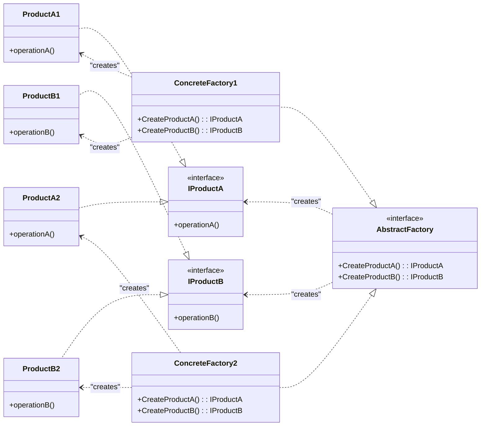
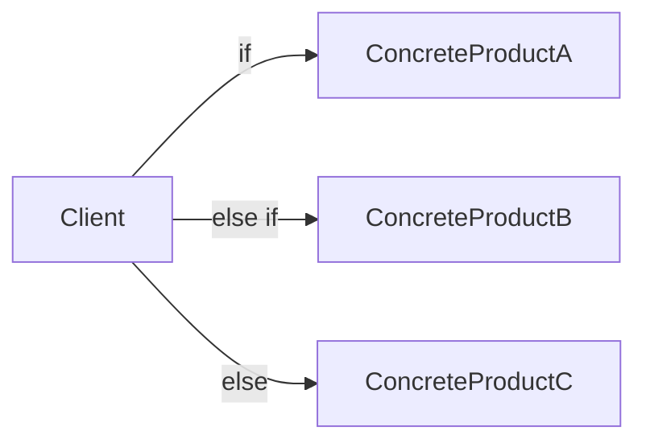
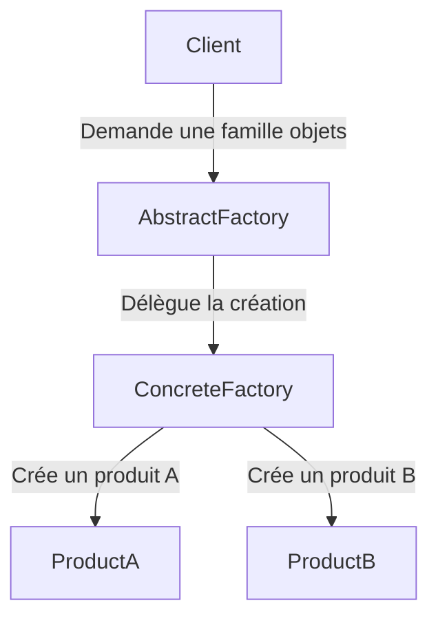

# Abstract Factory

## Explication

**Abstract Factory** correspond à un **design pattern de création** (*creational design pattern*). Le **Abstract Factory** est une interface qui permet de créer des familles d'objets liés ou dépendants sans avoir à spécifier leurs classes concrètes. Là où [Factory Method](../Factory%20Method/README.md) va plutôt se concentrer sur la création d'un seul type d'objet, le **Abstract Factory** va permettre de créer plusieurs types d'objets qui sont liés entre eux, en utilisant une interface commune pour les créer.

On différencie l'**Abstract Factory** du **Factory Method** de la façon suivante : le **factory method** désigne l'override d'une méthode pour la création d'objets, tandis que l'**abstract factory** désigne la création d'une interface pour la création d'objets, et des classes concrètes qui implémentent cette interface pour créer des familles d'objets spécifiques. Dit simplement, l'un est une méthode, l'autre une classe. C'est à dire que **Factory Method** repose sur l'*héritage* (une sous-classe redéfinit la méthode de création), **Abstract Factory** repose sur la *composition* (le client reçoit un objet factory par injection et lui délègue la création).

## Besoin

On utilise généralement l'**Abstract Factory** quand on a plusieurs **factory methods** qui sont amenées à être utilisées ensemble, c'est à dire quand on a besoin de créer des familles d'objets liés entre eux. Ainsi, on respecte la séparation des responsabilités.

## Implémentation

L'implémentation de l'**Abstract Factory** implique généralement de créer une interface `AbstractFactory` qui déclare les méthodes de création pour les différents types d'objets. Ensuite, on crée des classes concrètes `ConcreteFactory1`, `ConcreteFactory2`, etc. qui implémentent cette interface pour créer des familles d'objets spécifiques. Les objets créés doivent implémenter des interfaces communes `IProductA`, `IProductB`, etc. pour garantir que le client peut les utiliser de manière interchangeable.

Ainsi, le client ne connaît que l'interface **abstract factory**, qu'il utilise afin de créer les objets sans connaître les détails de leur implémentation concrète. L'implémentation de ce pattern favorise alors un couplage plus faible.

## Limitations

> ⚠️ L'**Abstract Factory** peut introduire une complexité supplémentaire au code, de ce fait, il n'est pas recommandé de l'implémenter lorsqu'on n'a pas besoin de créer des familles d'objets liés entre eux. Les **abstract factories** sont souvent critiquées à cause de la complexité parfois superflue qu'elles peuvent introduire, notamment lorsque la création d'un objet ne correspond pas à ce besoin de "famille".

> ⚠️ Ce design pattern implique une violation du principe Open/Closed, étant donné qu'il nécessite la modification de l'interface `AbstractFactory` pour ajouter de nouveaux types d'objets.

## Démonstration

[Code de démonstration](./AbstractFactoryDemo.cs)

## Sources

https://refactoring.guru/design-patterns/abstract-factory
https://refactoring.guru/design-patterns/factory-comparison
https://stackoverflow.com/questions/5739611/what-are-the-differences-between-abstract-factory-and-factory-design-patterns