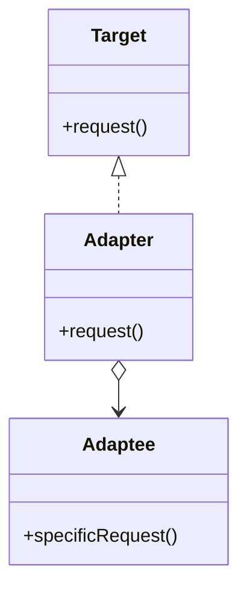
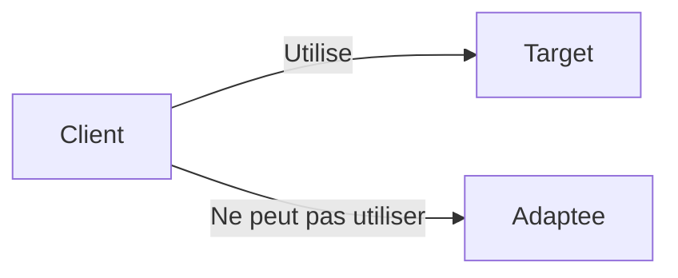

# Adapter

## Explication

**Adapter** désigne un **design pattern structurel** (*structural design pattern*). L'**adaptateur** est une classe qui permet de faire communiquer deux interfaces incompatibles. Il agit comme un *pont* entre les deux, en convertissant les appels d'une interface à l'autre.

Un **adaptateur** peut être utilisé pour intégrer une classe existante dans un système qui attend une interface différente, sans modifier la classe existante. Il est particulièrement utile lorsque vous travaillez avec des bibliothèques tierces ou du code legacy. Il existe même des cas de figure où l'adapter fonctionne dans les deux sens.

Ce schéma montre que l'**adaptateur** implémente l'interface **Target** et contient une référence à une instance de **Adaptee**. Lorsque le client appelle la méthode `request()` sur l'adaptateur, celui-ci traduit cet appel en un appel à `specificRequest()` sur l'adaptee.

## Besoin

Dans un système où il existe des classes avec des interfaces incompatibles, il peut être nécessaire de les faire communiquer sans modifier leur code source. On retrouve généralement ce cas de figure dans les systèmes qui intègrent du code legacy ou des bibliothèques tierces. Dans ce cas-ci, l'**adaptateur** permet de faire le lien entre les deux interfaces sans avoir à modifier les classes existantes.

Il est notamment important de mettre en place un **adaptateur** afin d'éviter des problèmes de régression sur du code existant.

## Implémentation

L'implémentation de l'**adaptateur** implique généralement de :

1. Créer une classe d'adaptateur qui implémente l'interface cible
2. Inclure une référence à l'instance de la classe à adapter
3. Traduire les appels de l'interface cible vers l'interface de l'adaptee

## Limitations

> ⚠️ Un adaptateur, bien qu'il puisse paraître adapté, rajoute parfois de la complexité inutile. Il est important de s'assurer que l'utilisation d'un adaptateur est justifiée par un besoin réel de compatibilité entre des interfaces incompatibles, et non pas simplement pour contourner un problème de conception qui pourrait être résolu autrement. Il est davantage pertinent de réadapter un service si possible.

> ⚠️ L'utilisation d'un adaptateur peut introduire une **surcharge de performance** (de ce fait, l'adapteur devient un *goulot d'étranglement*). C'est à dire, l'adaptateur peut ralentir le système à cause de la multiplication des appels et de la traduction entre les interfaces. Cela peut être particulièrement problématique si les appels sont fréquents ou si les méthodes traduites sont coûteuses en termes de ressources. 

## Démonstration

[Code de démonstration](./AdapterDemo.cs)

## Sources

https://refactoring.guru/design-patterns/adapter
https://web.archive.org/web/20170828230927/http://w3sdesign.com/?gr=s01&ugr=proble#gf