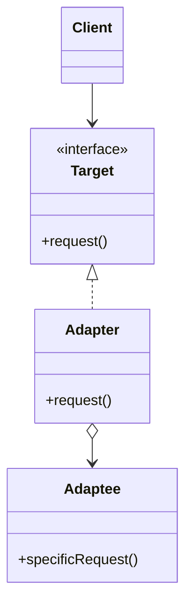
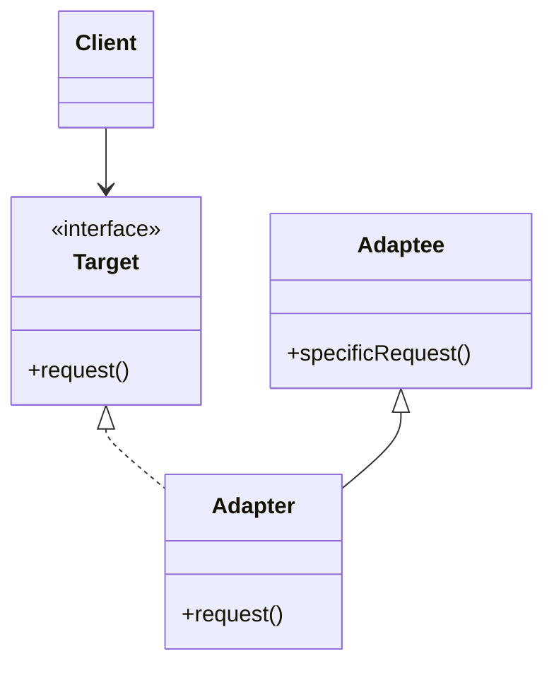
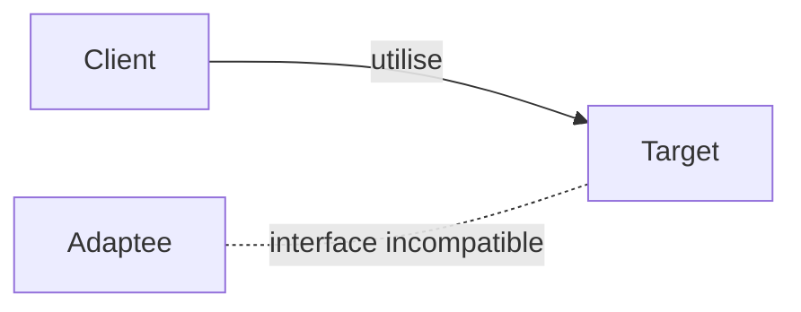
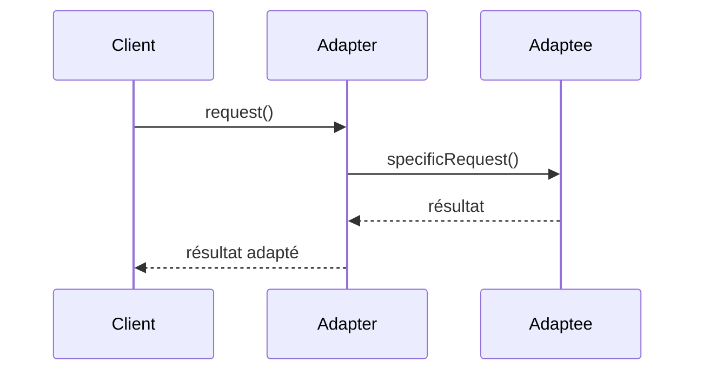

# Adapter

## Explication

**Adapter** correspond à un **design pattern structurel** (*structural design pattern*). L'**adaptateur** est une classe qui permet de faire communiquer deux interfaces incompatibles. Il agit comme un pont entre les deux, en convertissant les appels d'une interface à l'autre.

Un **adaptateur** peut être utilisé pour intégrer une classe existante dans un système qui attend une interface différente, sans modifier la classe existante. Il est particulièrement utile lorsque vous travaillez avec des bibliothèques tierces ou du code legacy.

Il existe deux variantes de ce pattern : l'**object adapter**, qui utilise la composition et le **class adapter**, qui utilise l'héritage multiple : l'adapter hérite à la fois de Target et d'Adaptee. 

Il y a également des cas de figure où l'adapter bidirectionnel (*two-way adapter*) implémente les deux interfaces simultanément, permettant ainsi la traduction dans les deux sens.

**Object adapter:**

Ce schéma montre que l'**adaptateur** implémente l'interface **Target** et contient une référence à une instance d'**Adaptee** injectée, dont le cycle de vie est indépendant de l'adaptateur. Lorsque le client appelle la méthode `request()` sur l'adaptateur, celui-ci traduit cet appel en un appel à `specificRequest()` sur l'Adaptee. Le client ne dépend que de l'interface Target et ignore totalement l'existence de l'Adaptee.

**Class adapter:**

Dans ce cas, l'**adaptateur** hérite à la fois de **Target** et d'**Adaptee**, ce qui lui permet de redéfinir la méthode `request()` pour appeler directement `specificRequest()`. Cependant, cette approche est plus *rigide* que **l'object adapter**, car elle impose une relation d'héritage entre l'adaptateur et l'adaptee, ce qui peut limiter la réutilisation de l'adaptateur avec différentes classes adaptees.

## Besoin

Dans un système où il existe des classes avec des interfaces incompatibles, il peut être nécessaire de les faire communiquer sans modifier leur code source. On retrouve généralement ce cas de figure dans les systèmes qui intègrent du code legacy ou des bibliothèques tierces. Dans ce cas, l'**adaptateur** permet de faire le lien entre les deux interfaces sans avoir à modifier les classes existantes.

Il est notamment important de mettre en place un **adaptateur** afin d'éviter des problèmes de régression sur du code existant.

## Implémentation

L'implémentation de l'**adaptateur** implique généralement de :

1. Créer une classe d'adaptateur qui implémente l'interface cible
2. Inclure une référence à l'instance de la classe à adapter
3. Traduire les appels de l'interface cible vers l'interface de l'Adaptee

## Limitations

> ⚠️ Un adaptateur, bien qu'il puisse paraître adapté, rajoute parfois de la complexité inutile. Il est important de s'assurer que son utilisation est justifiée par un besoin réel de compatibilité entre des interfaces incompatibles, et non pas simplement pour contourner un problème de conception qui pourrait être résolu autrement. Il est davantage pertinent de réadapter un service si possible.

> ⚠️ L'utilisation d'un adaptateur peut introduire une légère surcharge de performance. Dans la grande majorité des cas, cette surcharge est négligeable, l'adaptateur se réduisant à un simple appel délégué. Le risque de ralentissement ne concerne principalement que les adaptateurs qui effectuent des transformations de données coûteuses, comme la conversion de formats complexes ou des mappings importants.

## Démonstration

[Code de démonstration](./AdapterDemo.cs)

## Sources

https://refactoring.guru/design-patterns/adapter
https://web.archive.org/web/20170828230927/http://w3sdesign.com/?gr=s01&ugr=proble#gf