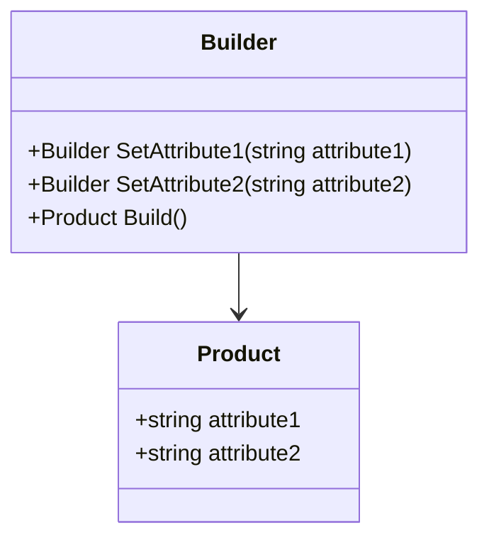
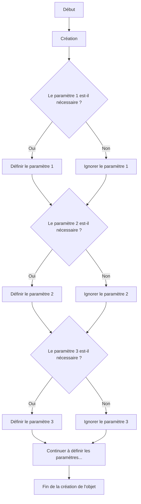
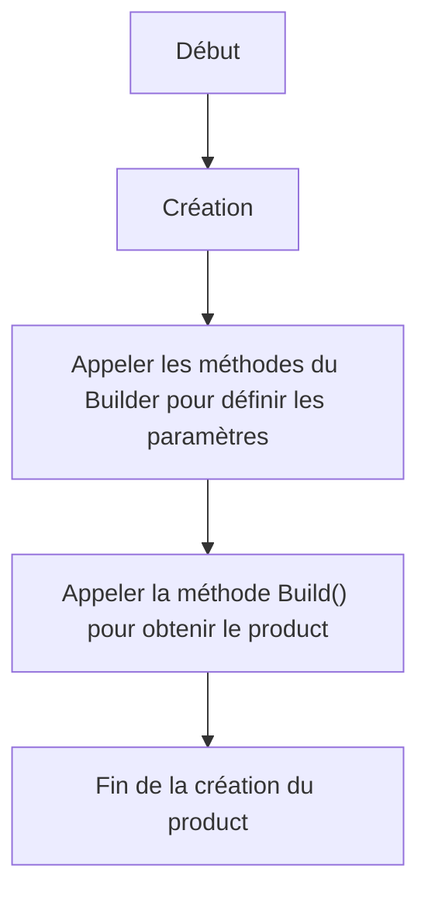

# Builder

## Explication

**Builder** correspond à un design pattern créationnel (*creational design pattern*) qui permet de construire un objet complexe étape par étape. Il ==sépare la construction d'un objet de sa représentation==, ce qui permet de créer différents types et représentations d'objets en utilisant le même processus de construction.

Avec l'aide d'un builder, on peut limiter le nombre de paramètres nécessaires pour créer un objet complexe, ce qui rend le code plus lisible et plus facile à maintenir. Le builder fournit une interface fluide pour la construction d'objets.

## Besoin

On utilise le **Builder** pattern quand la construction d'un objet est complexe et nécessite plusieurs étapes, ou quand on veut créer différentes représentations d'un objet en utilisant le même processus de construction. Il est particulièrement utile lorsque la création d'un objet nécessite de nombreux paramètres ou lorsque les paramètres sont optionnels.

Comme le montre le schéma ci-dessus, la création d'un objet complexe sans **builder** nécessite un empilement de conditions pour vérifier quels paramètres sont nécessaires.

On va aussi avoir tendance à implémenter ce design pattern afin de réduire en taille des **telescoping constructors** (*constructeurs à paramètres multiples*), qui ne sont pas forcément un *code smell* mais qui peuvent le devenir s'ils prennent trop en taille.

## Implémentation

L'implémentation du **Builder** pattern implique généralement la création d'une classe `Builder` qui contient des méthodes pour définir les différentes parties de l'objet complexe, ainsi qu'une méthode `Build()` qui retourne l'objet final construit, dit **product**.

On peut également utiliser une classe `Director` pour orchestrer le processus de construction, en appelant les méthodes du `Builder` dans un ordre spécifique.

Exemple du même schéma qu'au-dessus mais avec un builder :

## Limitations

> ⚠️ Le **Builder** pattern peut introduire une complexité supplémentaire dans le code, surtout si l'objet à construire n'est pas suffisamment complexe pour justifier son utilisation.

## Démonstration

[Code de démonstration](./BuilderDemo.cs)

## Sources

https://refactoring.guru/design-patterns/builder
https://iretha.github.io/design-patterns/creational/telescoping-constructor