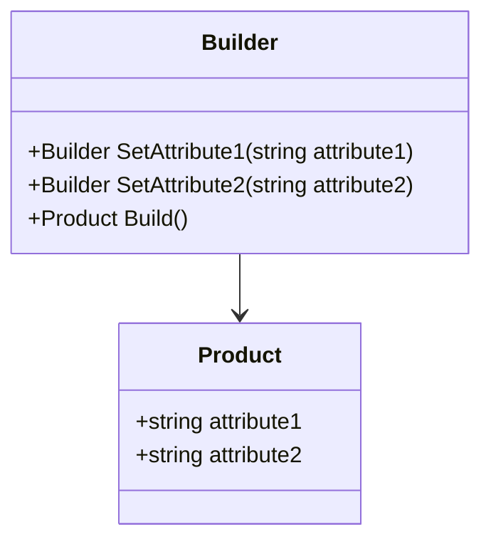
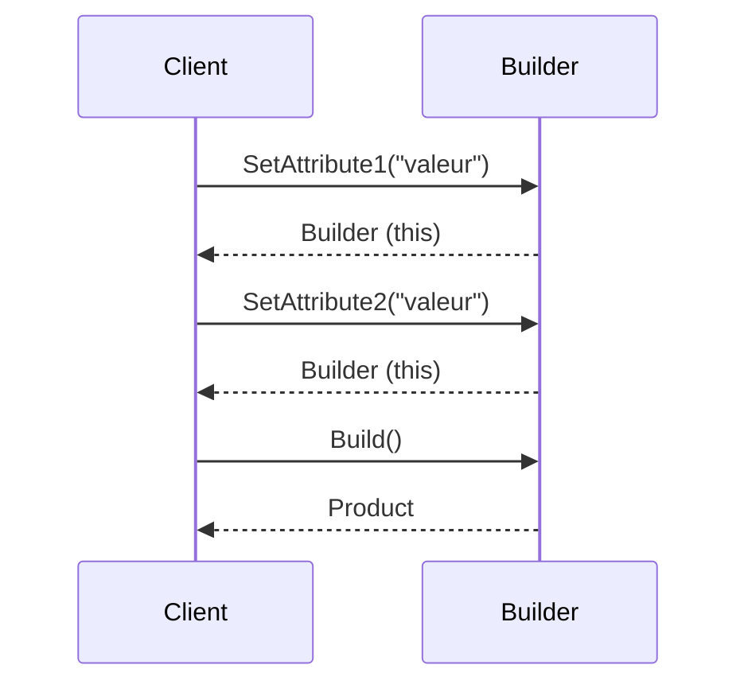
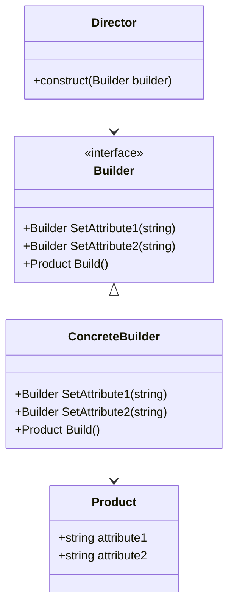

# Builder

## Explication

**Builder** correspond à un design pattern créationnel (*creational design pattern*) qui permet de construire un objet complexe étape par étape. Il **sépare la construction d'un objet de sa représentation**, ce qui permet de créer différents types et représentations d'objets en utilisant le même processus de construction.

Avec l'aide d'un builder, on peut limiter le nombre de paramètres nécessaires pour créer un objet complexe, ce qui rend le code plus lisible et plus facile à maintenir. Le builder fournit une interface fluide pour la construction d'objets : chaque méthode du Builder retourne l'instance du Builder elle-même (`this`), ce qui permet de chaîner les appels.



## Besoin

On utilise le **Builder** pattern quand la construction d'un objet est complexe et nécessite plusieurs étapes, ou quand on veut créer différentes représentations d'un objet en utilisant le même processus de construction. Il est particulièrement utile lorsque la création d'un objet nécessite de nombreux paramètres ou lorsque certains paramètres sont optionnels.

Le problème que résout le Builder est avant tout un problème de lisibilité et de maintenabilité. Sans Builder, on se retrouve avec des **telescoping constructors** (*constructeurs à paramètres multiples*) difficiles à lire et à faire évoluer :

```csharp
// Sans Builder -- telescoping constructor (exemple simplifié)
new Product("val1", "val2", null, null)

// Avec Builder -- interface fluide et chainee
new ProductBuilder()
    .SetAttribute1("val1")
    .SetAttribute2("val2")
    .Build()
```

Les telescoping constructors ne sont pas nécessairement un *code smell* en eux-mêmes, mais ils peuvent le devenir s'ils prennent trop d'ampleur.

## Implémentation

L'implémentation du **Builder** pattern implique généralement la création d'une classe `Builder` qui contient des méthodes pour définir les différentes parties de l'objet complexe, ainsi qu'une méthode `Build()` qui retourne l'objet final construit, dit **product**.



Le diagramme précédent montre la forme simplifiée du Builder (fluent builder), où le client chaîne lui-même les appels. Lorsqu'on introduit un `Director`, on abstrait le Builder en interface pour permettre plusieurs implémentations concrètes :



Le `Director` orchestre le processus de construction en appelant les méthodes du `Builder` dans un ordre spécifique, encapsulant ainsi une séquence de construction réutilisable. Cela évite de dupliquer la logique de construction dans chaque client. Par exemple, un Director pourrait exposer une méthode `ConstructStandardProduct()` et une méthode `ConstructPremiumProduct()`, chacune appelant les mêmes méthodes du Builder mais avec des configurations différentes.

## Limitations

> ⚠️ Le **Builder** pattern peut introduire une complexité supplémentaire dans le code, surtout si l'objet à construire n'est pas suffisamment complexe pour justifier son utilisation.

> ⚠️ Le Builder ne garantit pas à la compilation que toutes les étapes obligatoires ont été appelées. Un appel à `Build()` peut produire un objet dans un état invalide si des étapes sont oubliées. Des validations dans la méthode `Build()` sont nécessaires pour pallier ce risque.

## Démonstration

[Code de démonstration](./BuilderDemo.cs)

## Sources

https://refactoring.guru/design-patterns/builder
https://iretha.github.io/design-patterns/creational/telescoping-constructor