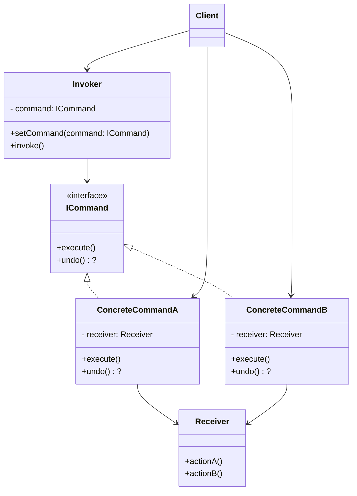
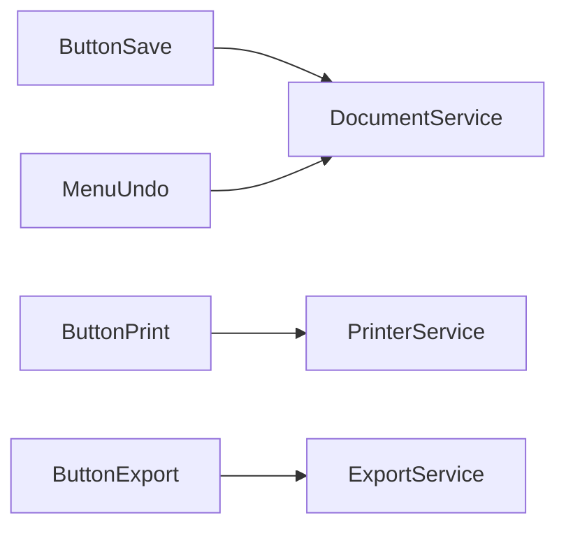
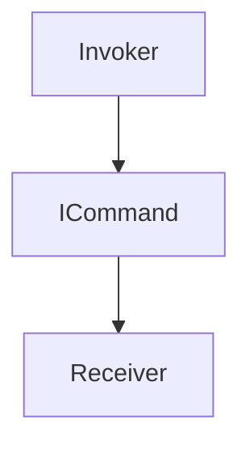

# Command

## Explication

**Command** désigne un **design pattern comportemental** (*behavioral design pattern*).

L’idée est d’**encapsuler une requête** (une action) dans un objet appelé **commande** (*command*). Une commande contient toutes les informations nécessaires pour exécuter l’action plus tard : **quoi faire**, **sur quel objet**, et éventuellement **avec quels paramètres**.

Ce pattern introduit généralement :
- un **Invoker** (ou *sender*) : déclenche l’exécution (bouton, queue…)
- une **Command** : interface commune avec une méthode d’exécution
- une ou plusieurs **ConcreteCommand** : implémentations des actions
- un **Receiver** : l’objet qui sait réellement effectuer le travail
- un **Client** : configure le tout (associe une commande à un invoker)

En pratique, le **client** ne déclenche pas directement le *receiver* : il passe par une commande, ce qui permet d’ajouter des fonctionnalités “autour” de l’action (historique, annulation, logs, retry, exécution différée, etc.).

## Besoin

Dans un système, on a souvent des actions qui doivent être :
- déclenchées depuis différents endroits (bouton, raccourci clavier, API...)
- mises en file (queue), planifiées, rejouées
- annulables (**undo/redo**)

Sans Command, l’Invoker (ex : un bouton) finit par appeler directement des méthodes métier, ce qui crée un **couplage fort** :

Le système devient difficile à faire évoluer :
- changer la logique d’exécution implique de toucher l’UI
- ajouter undo/redo impose de dupliquer de la logique partout
- impossible de mettre des actions en queue proprement

## Implémentation

La solution consiste à introduire des objets **Command** qui représentent des actions, et à faire en sorte que les **Invokers** ne connaissent que l’interface `ICommand`, pas le métier.

Le système se restructure ainsi :

- **Invoker** : ne sait qu’exécuter une commande
- **Command** : encapsule l’**intention** et la **délégation**
- **Receiver** : contient la logique métier réelle
- **Client** : instancie les commandes, injecte les receivers, et configure les invokers

Le pattern Command est surtout utile pour les systèmes qui :
- ont des actions déclenchées par une UI (boutons, menus) ou par un *orchestrateur*
- doivent tracer/auditer l’exécution des actions
- doivent proposer **undo/redo**
- doivent exécuter des actions **plus tard** (scheduler/queue) ou **à distance** (RPC/message bus)
- doivent composer des actions (macros, transactions applicatives)

## Limitations

> ⚠️ L’introduction de commandes peut ajouter de la complexité, surtout si les actions sont simples et ne nécessitent pas de fonctionnalités avancées. Il y a un risque d'**over-engineering**.

## Démonstration

[Code de démonstration](./CommandDemo.cs)

## Sources

https://refactoring.guru/design-patterns/command