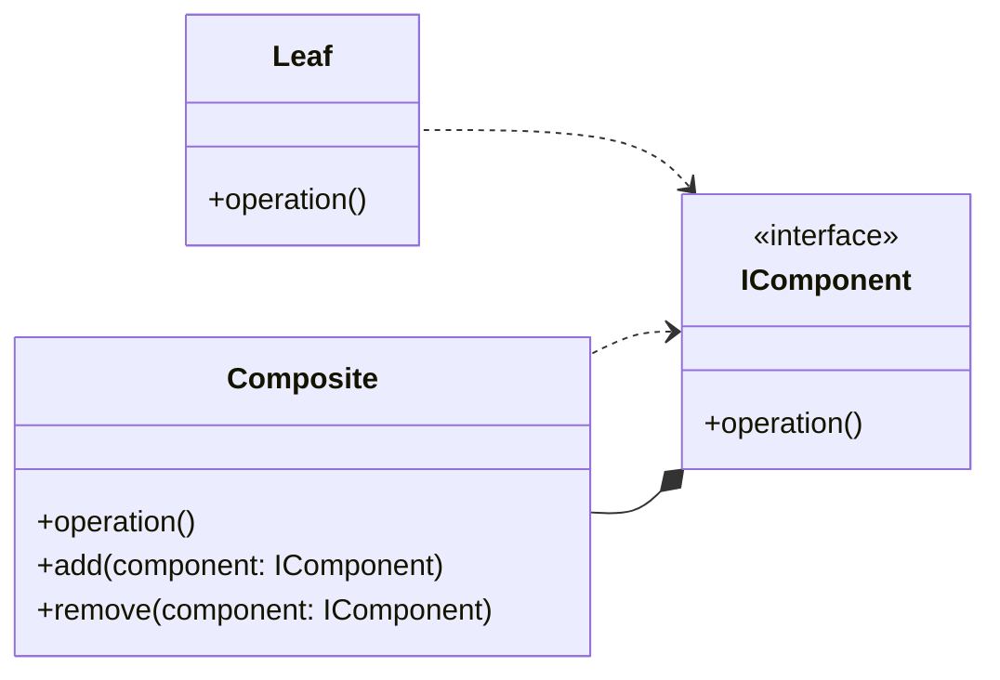
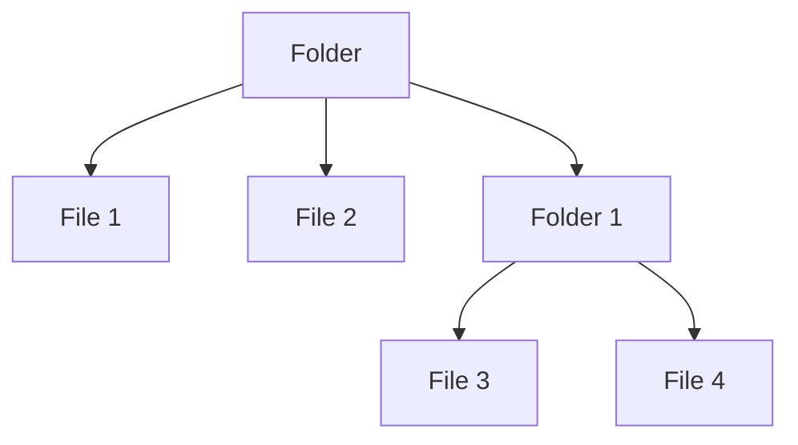

# Composite

## Explication

**Composite** est un **design pattern structurel** (*structural design pattern*). Il permet de traiter de manière uniforme des objets individuels et des compositions d'objets. Le **composite** est une classe qui peut contenir d'autres objets, appelés **composants** (*components*), qui peuvent être soit des objets individuels souvent appelés **feuilles** (*leafs*), soit d'autres composites (on imagine visuellement un arbre). Cela permet de créer des structures hiérarchiques d'objets, où les clients peuvent traiter les objets individuels et les compositions de manière uniforme.

Ainsi, on retrouve ce design pattern dans des structures nécessitant un traitement **récursif**, donc des arborescences, comme les systèmes de fichiers par exemple.

## Besoin

Il est recommandé d'utiliser le **composite** lorsqu'on a une arborescence d'objets, une hiérarchie, et que l'on souhaite accéder à chacun des objets de cette arborescence de la même manière. Ainsi, lorsqu'on se dit qu'il faudrait utiliser un mécanisme de récursivité pour effectuer cette opération, alors le **composite** est généralement le bon design pattern à mettre en place.

## Implémentation

L'implémentation du **composite** se fait généralement en créant une interface ou une classe abstraite qui définit les opérations communes à tous les composants (*feuilles* et *composites*). Les feuilles implémentent cette interface de manière simple, tandis que les composites implémentent les méthodes pour gérer les composants enfants et pour effectuer les opérations de manière **récursive**.

*(cf. schéma dans [Explication](##explication))*

## Limitations

> ⚠️ Les composites et les feuilles doivent partager une interface commune, cependant leurs responsabiilités peuvent généralement différer. On se retrouve alors à devoir faire des interfaces plus génériques, et ce manque de spécificité réduit la lisibilité du code.

> ⚠️ Il n'est pas clair s'il faut définir le comportement du composite dans l'interface commune ou s'il faut le déclarer au niveau de l'interface. Les feuilles, qui héritent de l'interface, vont implémenter une méthode qui renvoie une erreur (souvent, `NotImplementedException`), ce qui va à l'encontre du principe de **substitution de Liskov** (*Liskov Substitution Principle*). L'autre possibilité est de le définir au niveau du composite directement, sauf que on perd la garantie d'implémentation des méthodes. L'ambiguité fondamentale du design pattern réduit la lisibilité du code et nécessite une documentation précise.

## Démonstration

[Code de démonstration](./CompositeDemo.cs)

## Sources

https://refactoring.guru/design-patterns/composite
https://medium.com/@kalanamalshan98/composite-design-pattern-a-beginner-friendly-guide-5590d625f76b