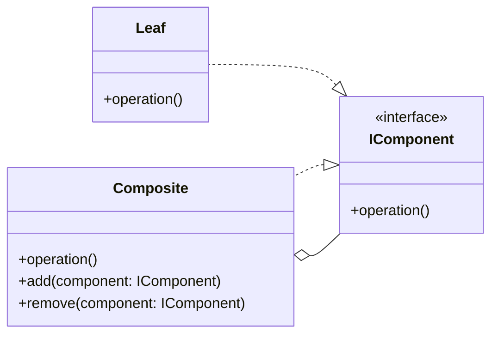
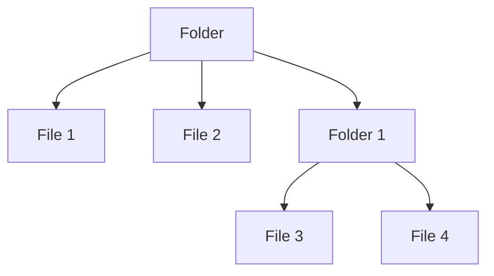
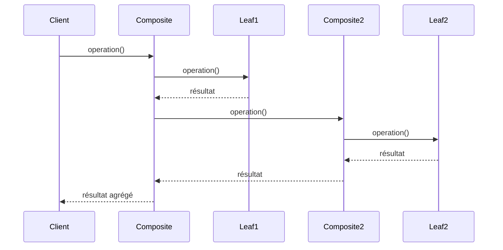

# Composite

## Explication

**Composite** est un **design pattern structurel** (*structural design pattern*). Il permet de traiter de manière uniforme des objets individuels et des compositions d'objets. Le **composite** est une classe qui peut contenir d'autres objets, appelés **composants** (*components*), qui peuvent être soit des objets individuels souvent appelés **feuilles** (*leafs*), soit d'autres composites (on imagine visuellement un arbre). Cela permet de créer des structures hiérarchiques d'objets, où les clients peuvent traiter les objets individuels et les compositions de manière uniforme.

Ainsi, on retrouve ce design pattern dans des structures nécessitant un traitement **récursif**, donc des arborescences, comme les systèmes de fichiers par exemple.

## Besoin

Il est recommandé d'utiliser le **composite** lorsqu'on a une arborescence d'objets, une hiérarchie, et que l'on souhaite accéder à chacun des objets de cette arborescence de la même manière. Ainsi, lorsqu'on se dit qu'il faudrait utiliser un mécanisme de récursivité pour effectuer cette opération, alors le **composite** est généralement le bon design pattern à mettre en place.

## Implémentation

L'implémentation du **composite** se fait généralement en créant une interface ou une classe abstraite qui définit les opérations communes à tous les composants (*feuilles* et *composites*). Les feuilles implémentent cette interface de manière simple, tandis que les composites implémentent les méthodes pour gérer les composants enfants et pour effectuer les opérations de manière **récursive**.

La mécanique clé du pattern est que lorsqu'un `Composite` reçoit un appel à `operation()`, il délègue cet appel à chacun de ses enfants, qu'ils soient des feuilles ou d'autres composites, puis agrège les résultats :

Le client n'a pas à distinguer les feuilles des composites : il appelle `operation()` sur n'importe quel `IComponent`, et la récursivité se charge du reste.

## Limitations

> ⚠️ Les composites et les feuilles doivent partager une interface commune, cependant leurs responsabilités peuvent généralement différer. On se retrouve alors à devoir faire des interfaces plus génériques, et ce manque de spécificité réduit la lisibilité du code.

> ⚠️ Le pattern pose un dilemme de conception : placer `add()` et `remove()` dans l'interface `IComponent` (approche **transparente**) permet de traiter tous les composants de manière uniforme, mais force les feuilles à implémenter des méthodes qui n'ont pas de sens pour elles, ce qui constitue une violation du **principe de substitution de Liskov** (*Liskov Substitution Principle*). Les placer uniquement dans `Composite` (approche **sûre**) préserve le typage, mais oblige le client à distinguer les feuilles des composites, réduisant ainsi l'uniformité de traitement. Le diagramme présenté ci-dessus suit l'approche sûre : `add()` et `remove()` sont déclarés uniquement dans `Composite`. Dans l'approche transparente, ces méthodes seraient remontées dans `IComponent`.

## Démonstration

[Code de démonstration](./CompositeDemo.cs)

## Sources

https://refactoring.guru/design-patterns/composite
https://medium.com/@kalanamalshan98/composite-design-pattern-a-beginner-friendly-guide-5590d625f76b