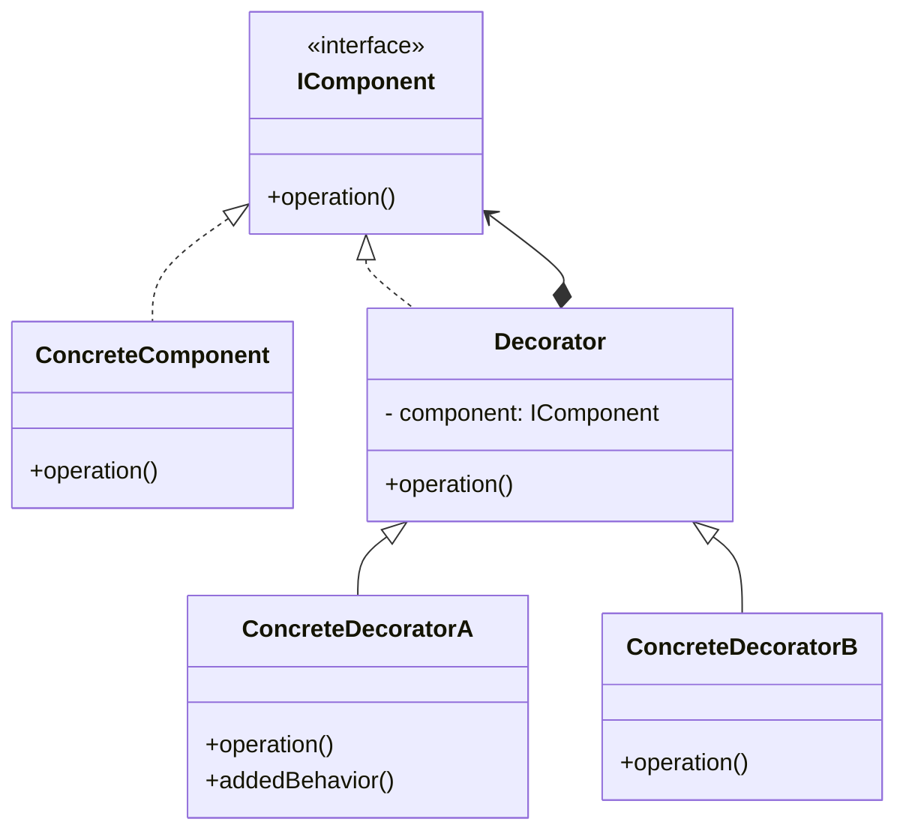
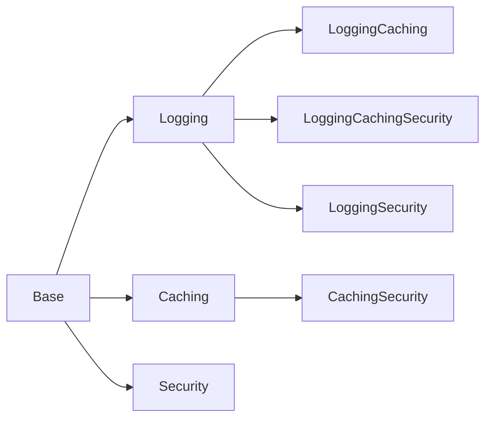
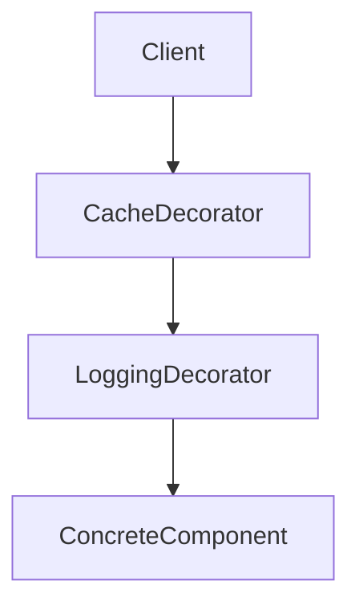
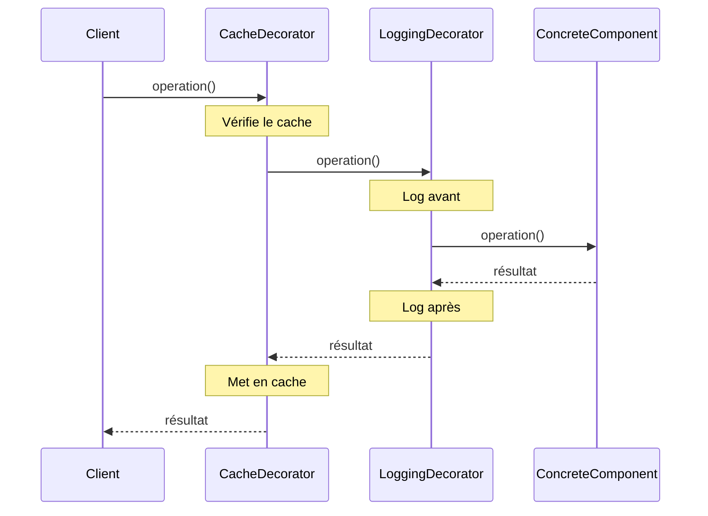

# Decorator

## Explication

Un **décorateur** (*decorator*) est un **design pattern structurel** (*structural design pattern*) qui permet d'ajouter **dynamiquement** des comportements à un objet sans modifier sa classe. Il repose sur le principe de **composition** plutôt que d'**héritage** : un décorateur encapsule un objet cible et délègue les appels tout en ajoutant sa propre logique.

Contrairement à une sous-classe classique, les fonctionnalités peuvent être **empilées dynamiquement** à l'exécution.

Le point clé est la **relation de composition** : le décorateur contient une référence vers un **Component** et en gère le cycle de vie dans la chaîne de décoration.

## Besoin

Le **Decorator** devient pertinent lorsque :

- on veut ajouter des responsabilités à un objet sans multiplier les sous-classes
- les combinaisons de comportements deviennent nombreuses
- certaines fonctionnalités doivent être activées dynamiquement

Sans ce pattern, chaque combinaison de comportements nécessite sa propre sous-classe, ce qui mène à une **explosion de sous-classes**, chaque noeud ci-dessous représente une classe concrète distincte :

> À ne pas confondre avec [**Strategy**](../Strategy/README.md), qui remplace un comportement par injection d'un algorithme alternatif. Le Decorator, lui, **empile** des comportements autour de l'objet existant sans en remplacer aucun.

## Implémentation

La solution consiste à introduire une classe **Décorateur** qui implémente la même interface que le **Composant**, tout en contenant une référence vers un objet de type composant.

Les *décorateurs concrets* encapsulent un composant existant et ajoutent des comportements avant ou après l'appel aux méthodes du composant encapsulé. Ainsi, le client manipule toujours une instance du composant, sans savoir s'il s'agit d'un objet décoré ou non.

Un décorateur permet de limiter l'explosion de sous-classes en combinant les comportements à la volée :

Le flux d'appel suit la chaîne dans les deux sens, chaque décorateur peut intervenir **avant et après** la délégation :

## Limitations

> ⚠️ L'utilisation excessive de décorateurs peut rendre le code difficile à comprendre. Devoir suivre une longue chaîne de décorateurs est moins lisible.

> ⚠️ Il est difficile de retirer un comportement ajouté par un décorateur une fois qu'il a été appliqué, car les décorateurs sont généralement conçus pour être empilés. Ainsi, une fois qu'un décorateur est appliqué, il devient une partie intégrante de l'objet décoré.

## Démonstration

[Code de démonstration](./DecoratorDemo.cs)

## Sources

https://refactoring.guru/design-patterns/decorator