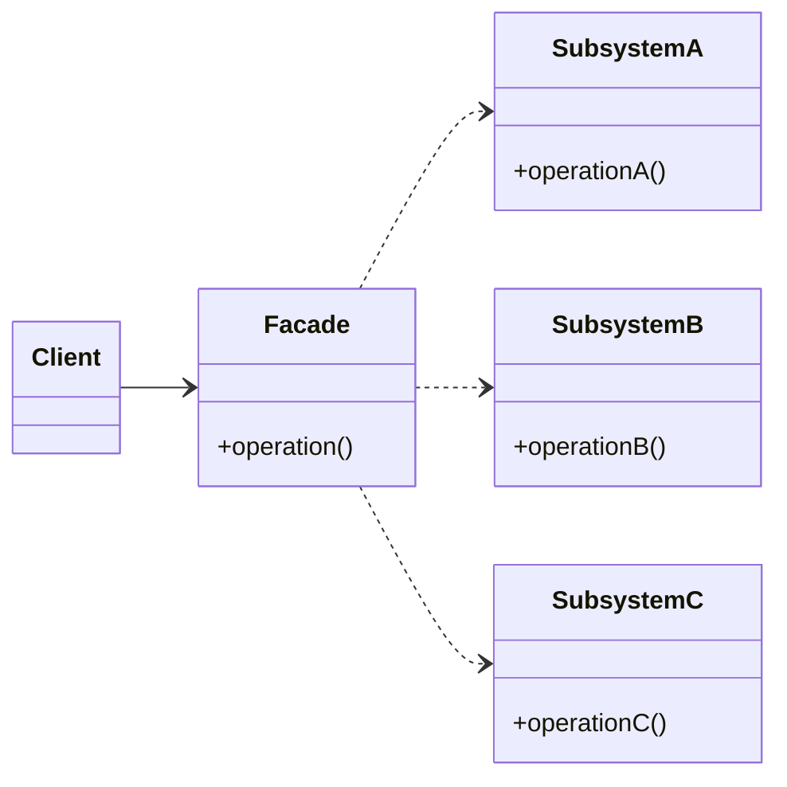
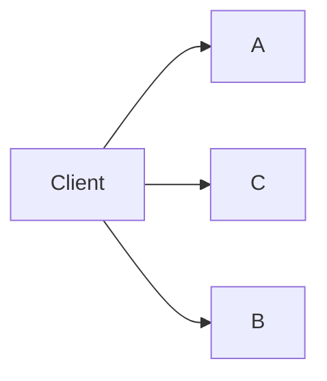
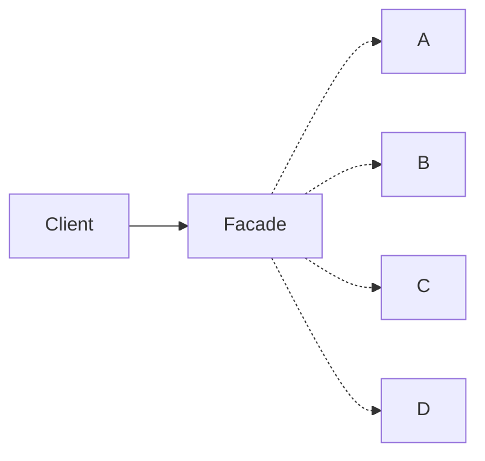

# Facade

## Explication

**Facade** est un **design pattern structurel** (*structural design pattern*). Il fournit une interface unifiée pour un ensemble d'interfaces dans un sous-système. La **façade** définit une interface de haut niveau qui rend le sous-système plus facile à utiliser. Autrement dit, la classe dite de **façade** agit comme un point d'entrée qui permet au client d'utiliser un ou plusieurs sous-systèmes sans en dépendre directement.

Les avantages de ce design pattern sont surtout la réduction des dépendances entre les clients et les sous-systèmes, ainsi que la simplification de l'utilisation du système en fournissant une interface plus simple et plus cohérente.

## Besoin

Lorsque un système se complexifie, que les couches se multiplient, et que les clients doivent interagir avec plusieurs sous-systèmes, le respect du **SoC** (*Separation of Concerns*) devient un véritable enjeu. 

Ainsi, la façade résout ce problème en fournissant une interface unifiée qui évite ce problème de dépendance directe. 

De plus, la multiplication de ces systèmes impliquent une certaine complexité, et la façade permet de simplifier l'utilisation du système en fournissant une interface plus simple et plus cohérente.

## Implémentation

L'implémentation de la **façade** se fait généralement en créant une classe qui *encapsule* les interactions avec les sous-systèmes. Cette classe fournit des méthodes qui simplifient l'utilisation du système en masquant la complexité des sous-systèmes. Les clients interagissent uniquement avec la façade, ce qui réduit les dépendances et améliore la maintenabilité du code.

## Limitations

> ⚠️ La façade peut devenir un **God object**, c'est à dire une classe qui connaît et gère tout. Ces classes deviennent difficiles à comprendre, même si elles respectent le principe de responsabilité unique sur papier. Une classe trop volumineuse doit malgré tout être fragmentée.

## Démonstration

[Code de démonstration](./FacadeDemo.cs)

## Sources

https://refactoring.guru/design-patterns/facade
https://en.wikipedia.org/wiki/God_object