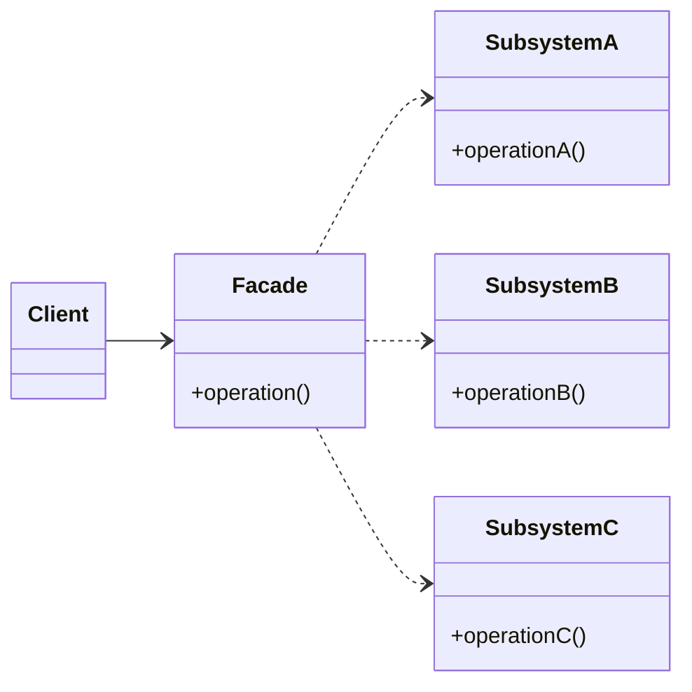
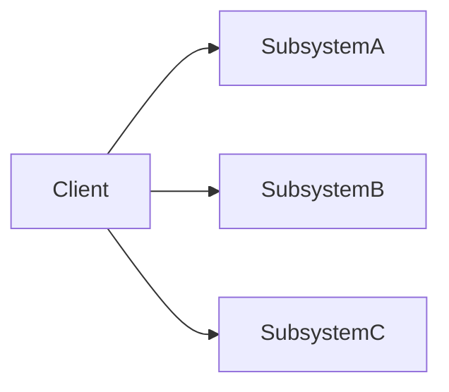
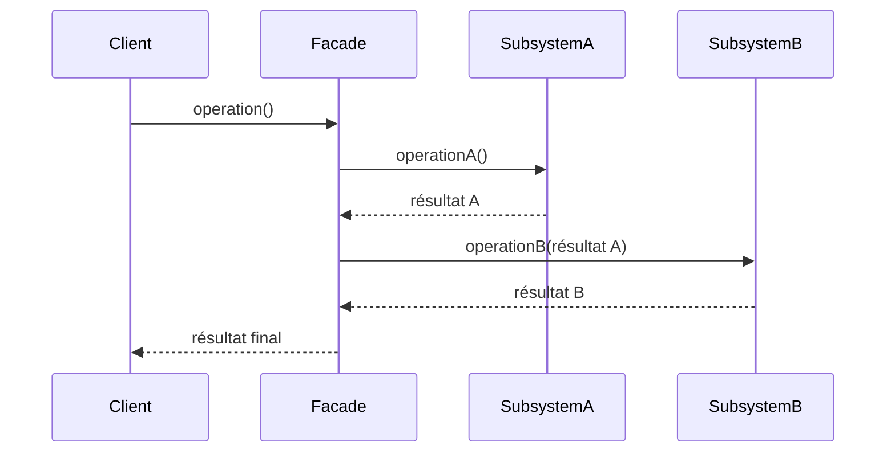

# Facade

## Explication

**Facade** est un **design pattern structurel** (*structural design pattern*). Il fournit une interface unifiée pour un ensemble d'interfaces dans un sous-système. La classe dite de **façade** agit comme un point d'entrée qui permet au client d'utiliser un ou plusieurs sous-systèmes sans en dépendre directement.

## Besoin

Lorsqu'un système se complexifie et que les couches se multiplient, les clients se retrouvent à dépendre directement de nombreux sous-systèmes. Cette dépendance directe crée un **couplage fort** : toute modification interne d'un sous-système peut se propager aux clients, et tester un client isolément devient difficile.

Sans façade, le client doit connaître et orchestrer lui-même chaque sous-système :

## Implémentation

La façade **orchestre** les appels aux sous-systèmes dans un ordre précis et renvoie un résultat consolidé au client. Le client n'a aucune connaissance de la séquence d'appels interne :

## Limitations

> ⚠️ La façade peut devenir un **God object**, c'est-à-dire une classe qui connaît et gère tout. Ces classes deviennent difficiles à comprendre, même si elles respectent le principe de responsabilité unique sur papier. Une classe trop volumineuse doit malgré tout être fragmentée.

> ⚠️ Si la façade ne couvre pas tous les cas d'usage nécessaires, les clients finissent par la contourner et accéder directement aux sous-systèmes, annulant le découplage recherché. La façade doit être conçue pour couvrir les scénarios courants, tout en laissant un accès contrôlé aux sous-systèmes si besoin.

## Démonstration

[Code de démonstration](./FacadeDemo.cs)

## Sources

https://refactoring.guru/design-patterns/facade
https://en.wikipedia.org/wiki/God_object