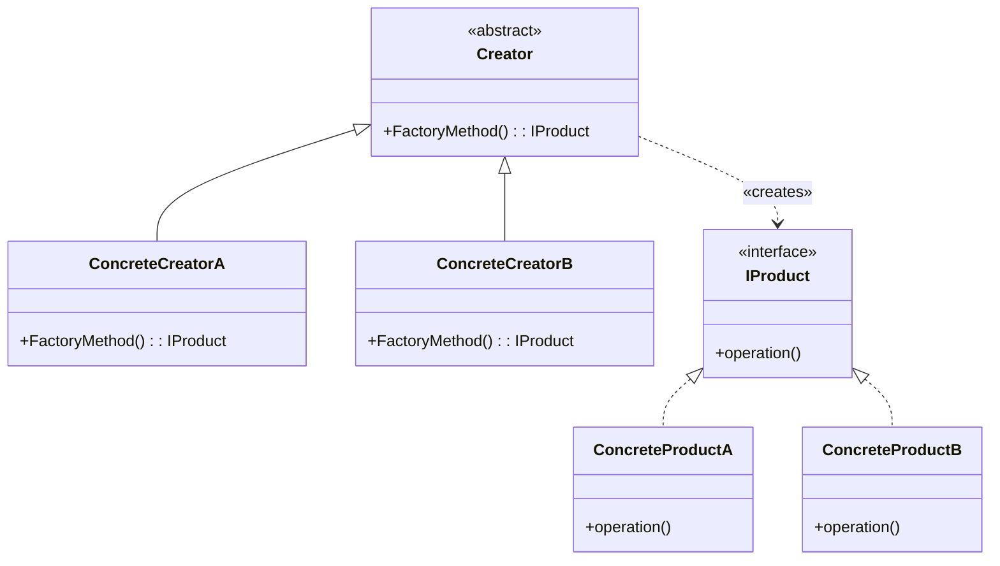
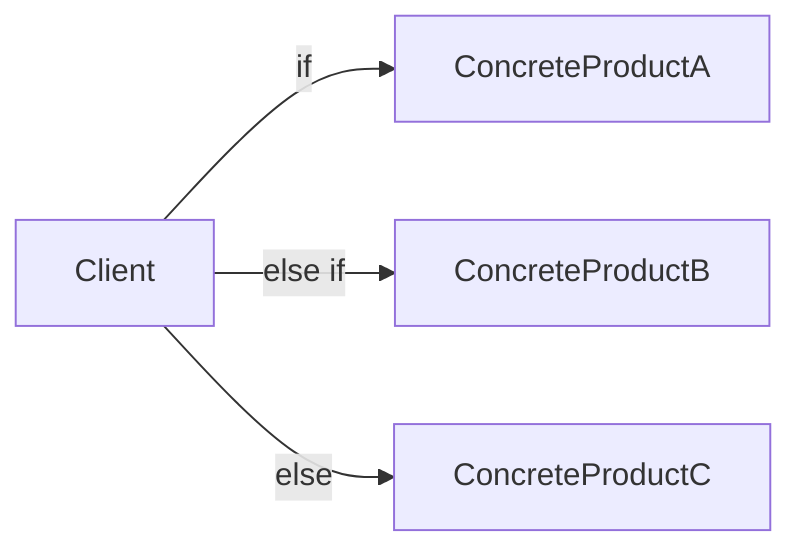
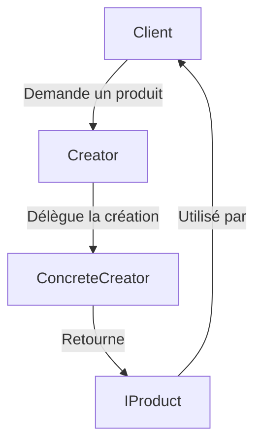

# Factory Method

## Explication

**Factory Method** correspond à un **design pattern de création** (*creational design pattern*). Le **Factory Method** est une méthode qui permet de créer des objets sans avoir à spécifier la classe concrète de l'objet à créer. Il s'agit d'une méthode *abstraite* qui doit être implémentée par les classes dérivées pour créer des objets spécifiques.

Pour ce faire, on définit une interface ou une classe abstraite qui déclare la méthode de création, et les classes concrètes implémentent cette méthode pour créer des objets spécifiques. Le client utilise la méthode de création pour obtenir des instances d'objets, sans avoir à connaître les détails de leur création.

## Besoin

Le design pattern **Factory Method** est souvent utilisé quand on ne connaît pas à l'avance les classes concrètes d'objets que le code doit créer, ou quand on veut permettre à des classes dérivées de spécifier les types d'objets à créer.

Il est notamment pertinent de le mettre en place quand on réalise une librairie ou un framework, et que les utilisateurs de cette librairie ou de ce framework doivent pouvoir créer des objets spécifiques sans avoir à connaître les détails de leur création. 

## Implémentation

L'implémentation du **Factory Method** implique généralement de créer une classe `Creator` qui déclare la méthode de création, et des classes concrètes `ConcreteCreatorA`, `ConcreteCreatorB`, etc. qui implémentent cette méthode pour créer des objets spécifiques. Les objets créés doivent implémenter une interface commune `IProduct` pour garantir que le client peut les utiliser de manière interchangeable.

Le client utilise la méthode de création pour obtenir des instances d'objets, sans avoir à connaître les détails de leur création. On réduit alors les dépendances. 

## Limitations

> ⚠️ La **Factory Method** ajoute une couche de complexité supplémentaire au code, de ce fait, il n'est pas recommandé de l'implémenter lorsqu'on n'a pas besoin de créer des objets de manière flexible ou lorsqu'on connaît à l'avance les classes concrètes d'objets. La complexité peut rendre le code plus difficile à parcourir et à maintenir.

## Démonstration

[Code de démonstration](./FactoryMethodDemo.cs)

## Sources

https://refactoring.guru/design-patterns/factory-method