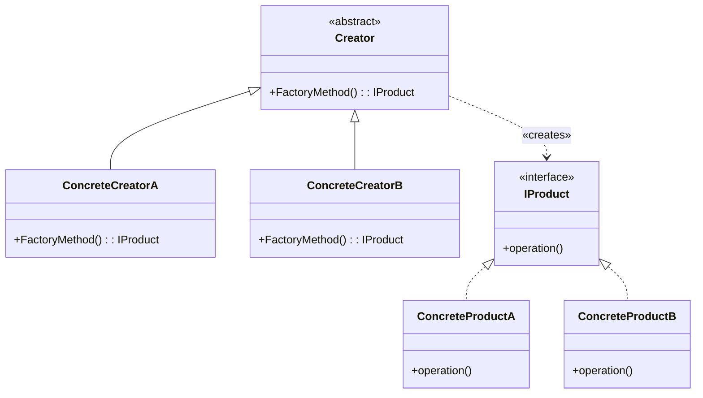
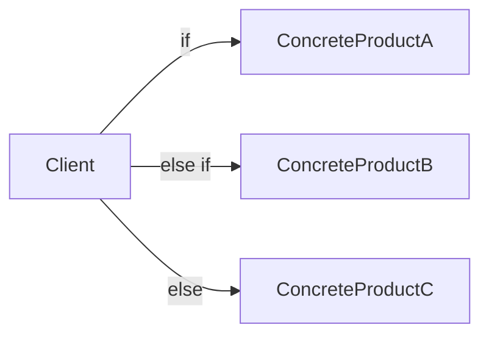
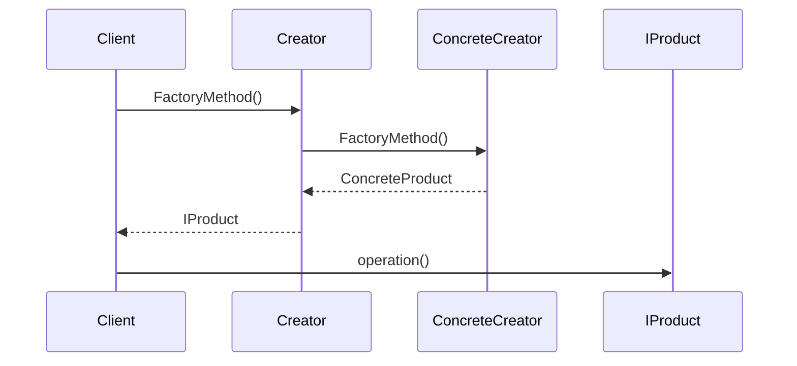

# Factory Method

## Explication

**Factory Method** est un **design pattern de création** (*creational design pattern*). Il définit une méthode abstraite de création d'objets dans une classe `Creator`, laissant aux classes dérivées le soin de décider quelle classe concrète instancier. Le client dépend uniquement de l'interface `IProduct`, jamais des classes concrètes.

## Besoin

Le pattern **Factory Method** est pertinent lorsqu'on ne connaît pas à l'avance les classes concrètes à instancier, ou lorsqu'on conçoit une librairie ou un framework dont les utilisateurs doivent pouvoir étendre les types produits sans modifier le code existant.

Sans ce pattern, le client instancie directement les produits via un branchement conditionnel :

Ce branchement viole le **principe ouvert/fermé** (*OCP*) : ajouter un nouveau produit oblige à modifier le code client existant.

## Implémentation

Le `Creator` abstrait déclare la `FactoryMethod()`. Chaque `ConcreteCreator` l'implémente pour instancier le produit qui lui correspond. Le client appelle la `FactoryMethod()` sur le `Creator` et reçoit un `IProduct` sans jamais connaître la classe concrète instanciée :

## Limitations

> ⚠️ Le **Factory Method** ajoute une couche de complexité supplémentaire. Il n'est pas recommandé de l'implémenter lorsque les classes concrètes à instancier sont connues à l'avance et ne sont pas amenées à varier.

> ⚠️ Chaque nouveau type de produit nécessite un nouveau `ConcreteCreator`, ce qui peut mener à une prolifération de classes parallèles entre la hiérarchie des créateurs et celle des produits.

## Démonstration

[Code de démonstration](./FactoryMethodDemo.cs)

## Sources

https://refactoring.guru/design-patterns/factory-method