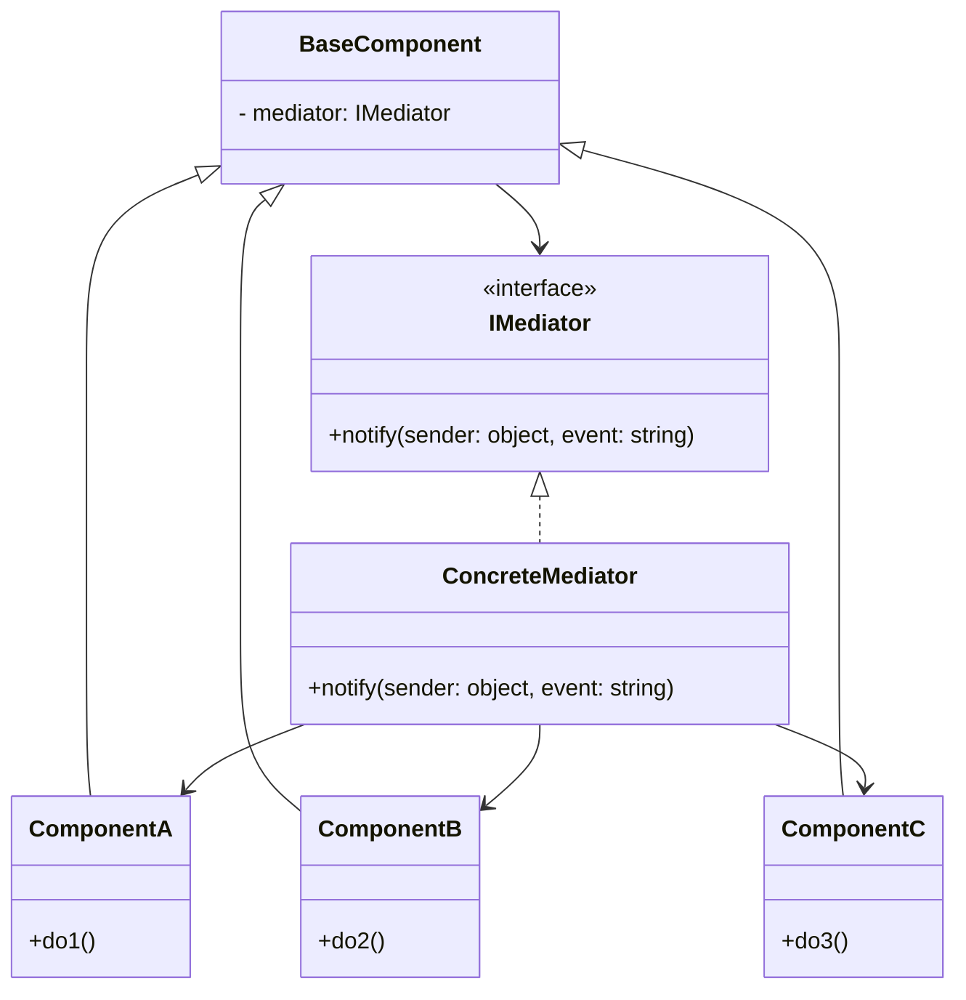
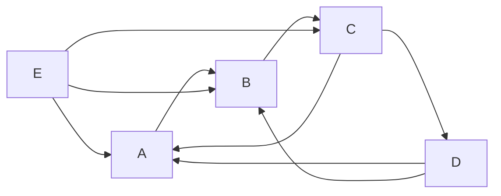
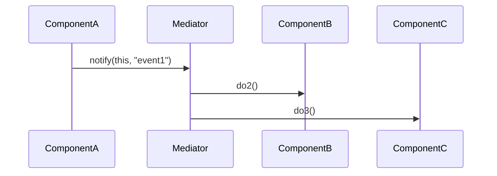
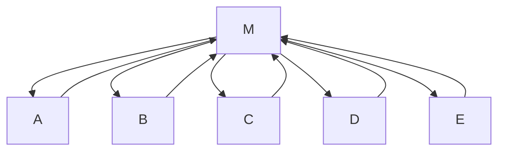

# Mediator

## Explication

**Mediator** est un **design pattern comportemental** (*behavioral design pattern*). Le **médiateur** agit comme *chef d'orchestre* entre des **composants** (*components*) : il centralise la logique de communication et supprime les dépendances directes entre composants. Chaque composant connaît uniquement le médiateur.

## Besoin

Dans un système complexe, les composants peuvent être fortement **couplés**, ce qui rend le code difficile à maintenir, à faire évoluer, et les composants sont difficilement réutilisables. Ces systèmes prennent une forme *spaghetti* :

Le pattern **Mediator** est particulièrement pertinent lorsque :

- des classes sont fortement couplées à d'autres classes qui interagissent entre elles
- des classes ne sont pas ou peu réutilisables à cause de leur couplage, forçant la création de classes proches

## Implémentation

Chaque composant communique uniquement avec le médiateur via `notify()`. Le médiateur décide seul quels composants réagissent à quel événement :

La communication centralisée donne au système une structure claire :

## Limitations

> ⚠️ Le médiateur peut devenir un **God object**, c'est-à-dire une classe qui connaît et gère tout. Ces classes deviennent difficiles à comprendre, même si elles respectent le principe de responsabilité unique sur papier. Une classe trop volumineuse doit malgré tout être fragmentée.

> ⚠️ Si les composants dépendent d'une implémentation concrète du médiateur plutôt que d'une abstraction (`IMediator`), leur testabilité en isolation est compromise.

## Démonstration

[Code de démonstration](./MediatorDemo.cs)

## Sources

https://refactoring.guru/design-patterns/mediator
https://en.wikipedia.org/wiki/God_object