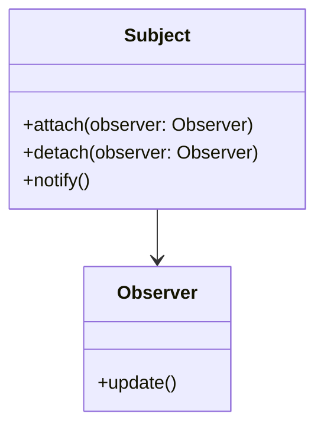
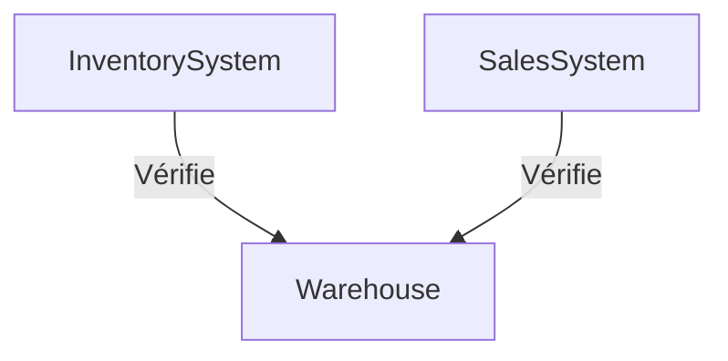
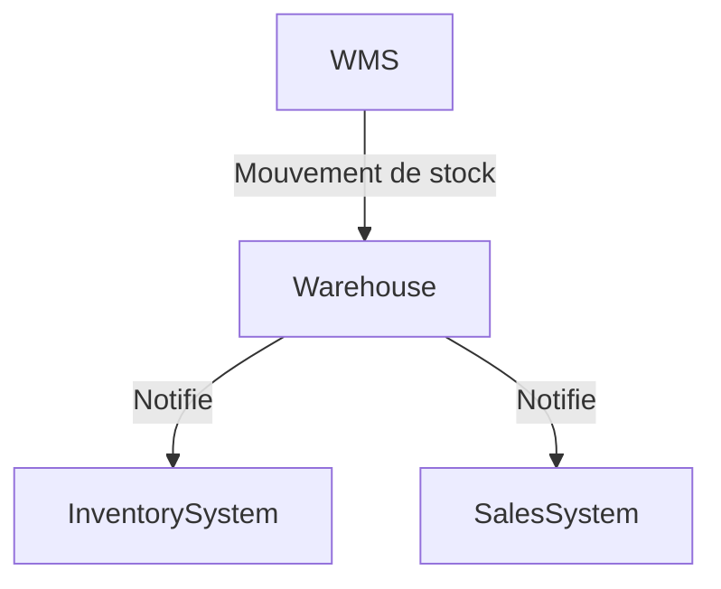
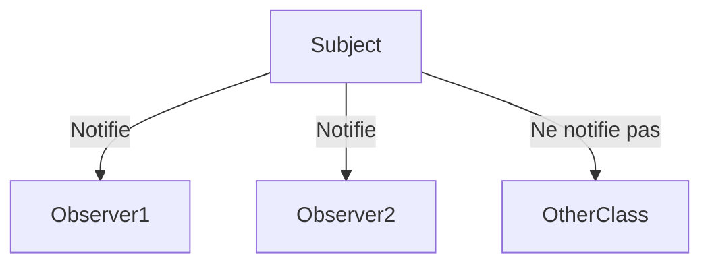

# Observer

## Explication

**Observer** désigne un **design pattern comportemental** (*behavioral design pattern*). L'**observateur** est une classe qui reçoit des notifications d'un autre objet, appelé **sujet** (*subject*), lorsqu'un événement se produit. Le sujet maintient une liste d'observateurs et les notifie automatiquement de tout changement d'état.

Le sujet notifie les observateurs, on le considère alors un **publicateur** (*publisher*), tandis que les observateurs sont des **abonnés** (*subscribers*). 

## Besoin

Dans un système où plusieurs objets doivent être informés de changements d'état d'un autre objet, les objets seraient fortement couplés sans système de notification. 

Par exemple, un système de gestion de stock pourrait nécessiter que plusieurs composants soient informés lorsqu'un produit est en rupture de stock. Sans la mise en place d'un **pattern Observer**, chaque composant devrait vérifier régulièrement l'état du stock. 

Sinon, l'état du stock pourrait aussi envoyer son état à tous les composants, même ceux qui n'ont pas besoin de cette information. Le système de vente pourrait être informé de changements de stock alors qu'il n'en a pas besoin par exemple.

Le système perd fortement en performance et est davantage rigide.

## Implémentation

La solution consiste à introduire une classe **Sujet** qui maintient une liste d'**Observateurs** et les notifie automatiquement de tout changement d'état. Les **Observateurs** s'abonnent au **Sujet** pour recevoir des notifications.

Autrement dit, le **sujet** appelle tous ceux figurant dans sa liste d'**observateurs** lorsqu'un événement se produit, tandis que les autres classes ne sont pas notifiées si elles ne sont pas.

## Limitations

> ⚠️ L'ordre de notification n'est pas garanti, ce qui peut poser des problèmes si les observateurs ont des dépendances entre eux.

## Démonstration

[Code de démonstration](./ObserverDemo.cs)

## Sources

https://refactoring.guru/design-patterns/observer