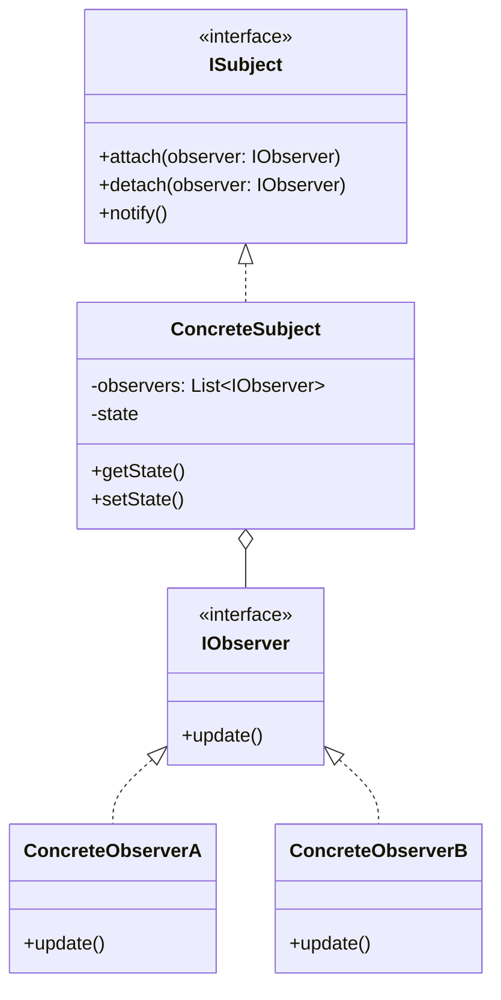
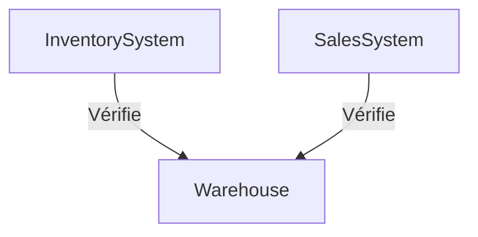
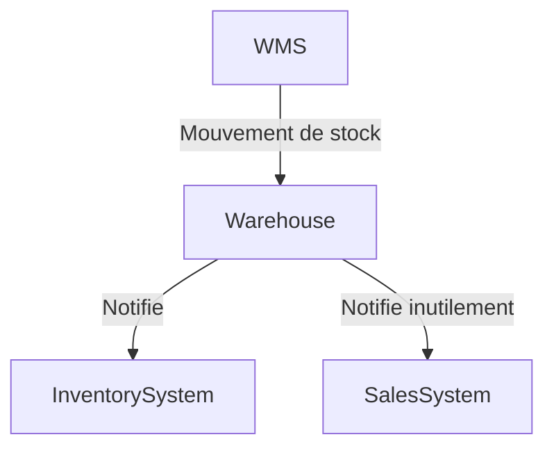
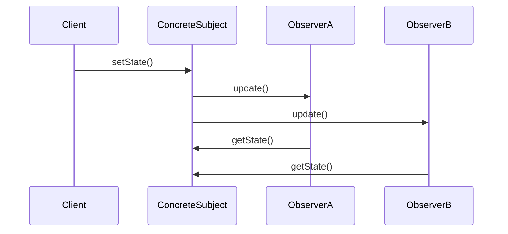

# Observer

## Explication

**Observer** est un **design pattern comportemental** (*behavioral design pattern*). Le **sujet** (*subject*) maintient une liste d'**observateurs** et les notifie automatiquement de tout changement d'état. Le sujet est aussi appelé **publicateur** (*publisher*), et les observateurs des **abonnés** (*subscribers*).

## Besoin

Dans un système où plusieurs objets doivent être informés des changements d'état d'un autre objet, deux approches naïves posent problème.

Le **polling** : chaque composant vérifie régulièrement l'état du sujet, ce qui génère des appels inutiles et dégrade les performances :

La **notification aveugle** : le sujet notifie tous les composants connus, y compris ceux qui n'ont pas besoin de l'information, `SalesSystem` reçoit ici des notifications de mouvements de stock qui ne le concernent pas :

Dans les deux cas, le système est rigide et les composants sont couplés.

## Implémentation

Les observateurs s'abonnent au sujet via `attach()`. Lors d'un changement d'état, le sujet appelle `update()` sur chaque observateur abonné. Chaque observateur récupère ensuite l'état via `getState()` ; on parle de **push** (notification) / **pull** (lecture de l'état) :

Les composants non abonnés ne reçoivent aucune notification.

## Limitations

> ⚠️ L'**ordre de notification** n'est pas garanti, ce qui peut poser des problèmes si les observateurs ont des dépendances entre eux.

> ⚠️ **Fuites mémoire** : si un observateur n'est pas correctement détaché via `detach()`, le sujet conserve une référence vers lui, empêchant sa libération par le garbage collector (*lapsed listener problem*).

> ⚠️ **Cascades de notifications** : un observateur qui modifie l'état du sujet dans son `update()` peut déclencher une boucle de notifications.

## Démonstration

[Code de démonstration](./ObserverDemo.cs)

## Sources

https://refactoring.guru/design-patterns/observer