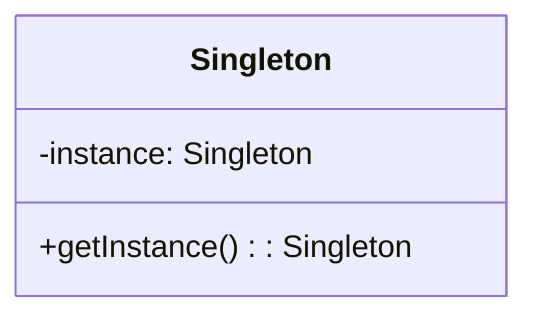
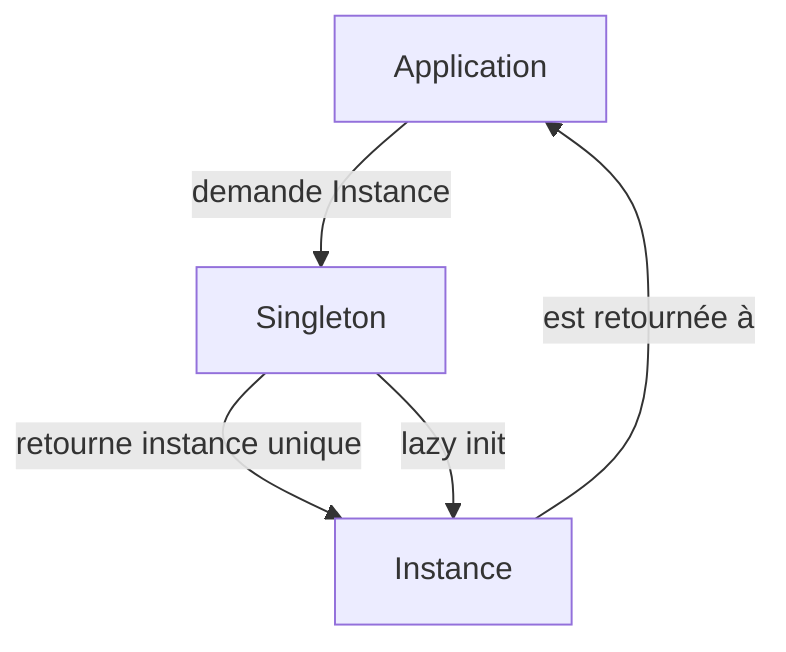

# Singleton

## Explication

**Singleton** désigne un **design pattern de création** (*creational design pattern*). Le **singleton** est une classe qui ne peut être instanciée qu'une seule fois. Elle fournit un *point d'accès global* à cette **instance**, garantissant ainsi que toutes les parties du code utilisent la même **instance**.

## Besoin

Dans certaines situations, il est nécessaire de s'assurer qu'une classe n'a qu'une seule **instance** et de fournir un point d'accès global à celle-ci. Cela peut être utile pour des classes qui gèrent des ressources partagées, comme des connexions à une base de données.

## Implémentation

L'implémentation du **singleton** implique généralement de :
1. **privatiser le constructeur** : Le constructeur de la classe est rendu privé pour empêcher la création d'instances en dehors de la classe elle-même.
2. **fournir un point d'accès global** : Une méthode statique est fournie pour accéder à l'instance unique.
3. **mettre en place une stratégie de "lazy initialization"** : L'instance est créée au premier appel, puis réutilisée pour les appels suivants.

## Limitations

>⚠️ Le **singleton**, dans un contexte de **multi-thread**, nécessite d'être adapté afin d'éviter les **problèmes de concurrence** lors de la création de l'instance. Un problème de concurrence implique que plusieurs threads vont essayer de créer **l'instance** en même temps.

>⚠️ Il ne respecte pas le **principe de responsabilité unique**, car il gère à la fois la création de l'instance et la logique métier associée. La multiplication des responsabilités peut rendre la classe difficile à tester *unitairement*.

## Démonstration

[Code de démonstration](./SingletonDemo.cs)

## Sources

https://refactoring.guru/design-patterns/singleton
https://en.wikipedia.org/wiki/Lazy_initialization