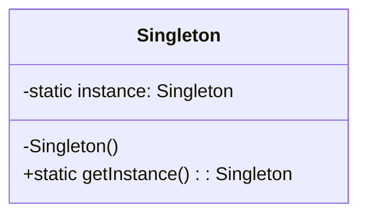
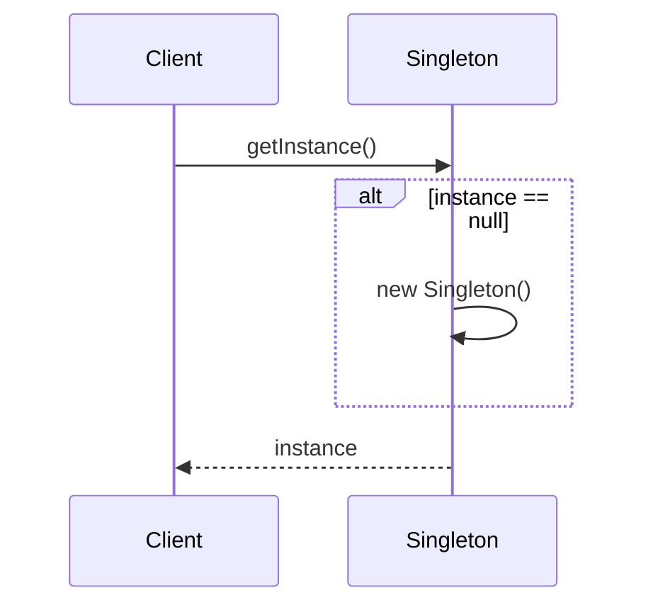

# Singleton

## Explication

**Singleton** est un **design pattern de création** (*creational design pattern*). Le **singleton** est une classe qui ne peut être instanciée qu'une seule fois. Elle fournit un *point d'accès global* à cette **instance**, garantissant que toutes les parties du code utilisent le même objet.

## Besoin

Dans certaines situations, il est nécessaire de s'assurer qu'une classe n'a qu'une seule **instance** et de fournir un point d'accès global à celle-ci. Cela est utile pour des classes qui gèrent des ressources partagées, comme des connexions à une base de données.

## Implémentation

L'implémentation du **singleton** implique généralement de :

1. **Rendre le constructeur privé** : empêche la création d'instances en dehors de la classe elle-même.
2. **Fournir un point d'accès global** : une méthode statique `getInstance()` expose l'instance unique.
3. **Mettre en place une *lazy initialization*** : l'instance est créée au premier appel, puis réutilisée pour les appels suivants. Cette approche n'est pas *thread-safe* par défaut (voir Limitations).

## Limitations

> ⚠️ La ***lazy initialization*** n'est pas *thread-safe* par défaut : dans un contexte **multi-thread**, plusieurs threads peuvent tenter de créer l'instance simultanément, produisant plusieurs instances distinctes.

> ⚠️ Il ne respecte pas le **principe de responsabilité unique** (*SRP*) : il gère à la fois la création de l'instance et la logique métier associée, ce qui rend la classe difficile à tester unitairement.

> ⚠️ Le Singleton introduit un **état global implicite** : les classes qui appellent `getInstance()` ont une dépendance cachée, non exprimée dans leurs constructeurs, ce qui nuit à la lisibilité et à la testabilité.

## Démonstration

[Code de démonstration](./SingletonDemo.cs)

## Sources

https://refactoring.guru/design-patterns/singleton
https://en.wikipedia.org/wiki/Lazy_initialization