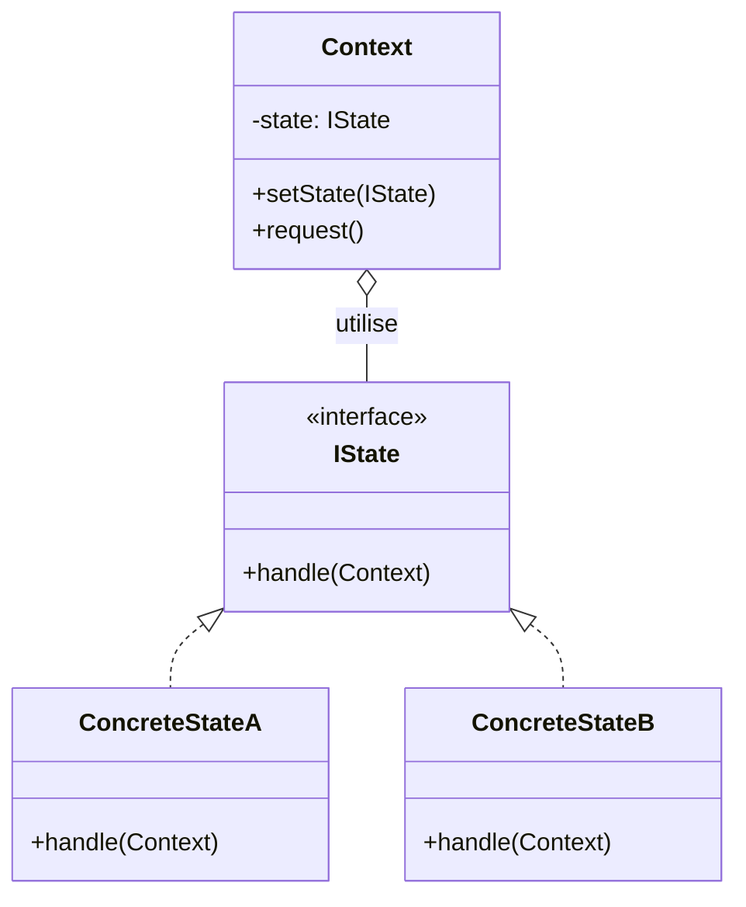
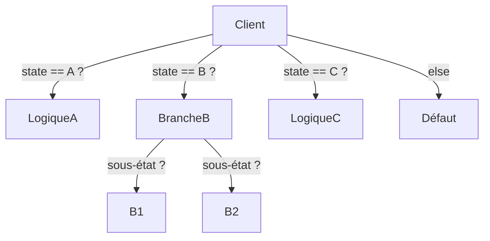
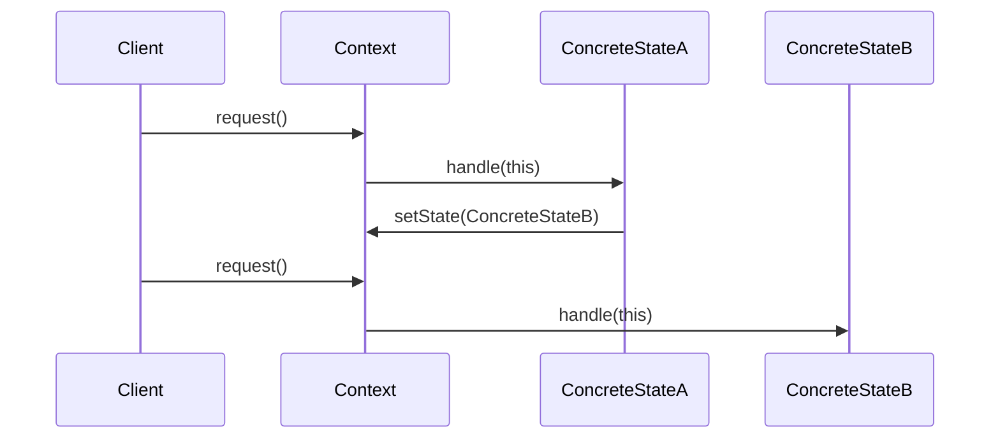
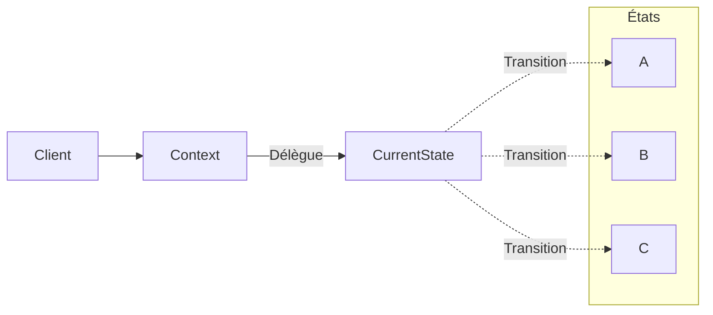

# State

## Explication

**State** est un **design pattern comportemental** (*behavioral design pattern*). Le **state** est une classe qui représente un état particulier d'un objet et contient la logique de comportement associée à cet état. L'objet d'origine est appelé **Context**, similairement à [**Strategy**](../Strategy/README.md), et détient une référence vers son état actuel. Contrairement aux stratégies, les states peuvent transitionner d'eux-mêmes : un state peut décider de changer l'état du Context en fonction de certaines conditions.

## Besoin

Lorsqu'un objet peut se trouver dans différents états et que son comportement doit changer en conséquence, une approche naïve accumule des structures conditionnelles imbriquées dans le Context. Plus chaque état se complexifie, plus ces conditions gonflent :

Le **State pattern** permet de regrouper la logique de chaque état dans une classe dédiée, réduisant la taille du Context et rendant le code plus lisible et maintenable.

## Implémentation

On crée une interface `IState` avec une méthode `handle(Context)`. Chaque état concret implémente cette interface et peut, depuis `handle()`, appeler `context.setState()` pour déclencher lui-même une transition :

La logique conditionnelle du Besoin est remplacée par une délégation claire vers l'état courant :

## Limitations

> ⚠️ **Overengineering** (*sur-ingénieurie*): le State pattern ne devrait pas être appliqué systématiquement. Quelques conditions simples sont parfois préférables à l'introduction de plusieurs classes d'état.

> ⚠️ **Couplage entre états** : si un état concret instancie directement un autre état pour transitionner (ex. `context.setState(new ConcreteStateB())`), cela crée un couplage entre classes d'état.

## Démonstration

[Code de démonstration](./StateDemo.cs)

## Sources

https://refactoring.guru/design-patterns/state
[Strategy/README.md](../Strategy/README.md)