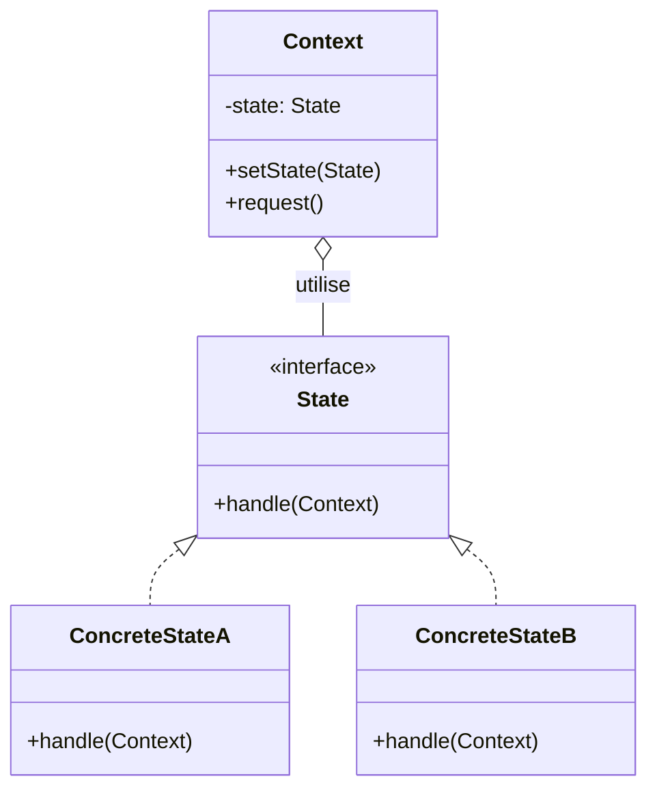
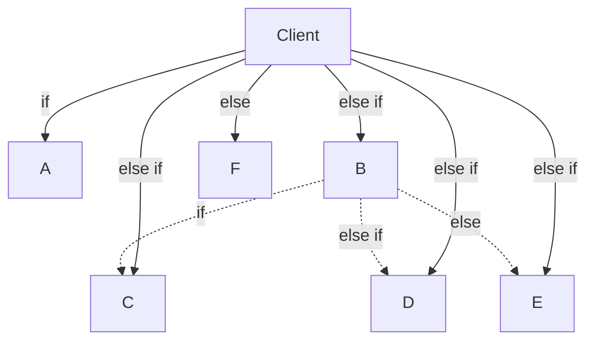
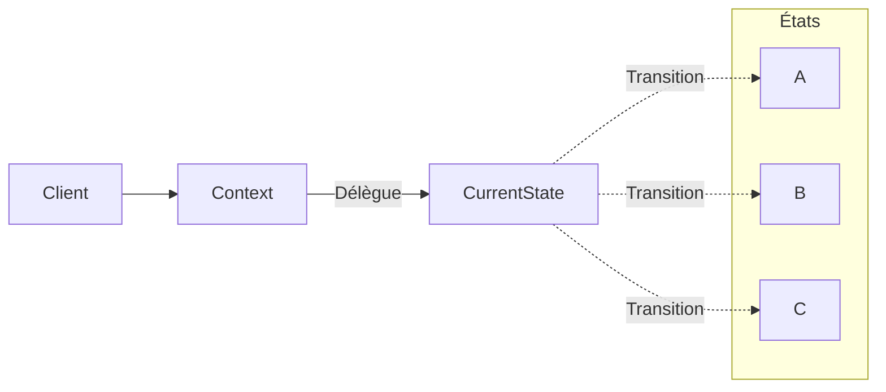

# State

## Explication

**State** correspond à un **design pattern comportemental** (*behavioral design pattern*). Le **state** (ou *l'état*) est une classe qui représente un état particulier d'un objet, et qui contient la logique de comportement associée à cet état. L'objet qui utilise le **state** peut changer de comportement en fonction de son état actuel.

L'objet d'origine est appelé **Context**, similairement à [**Strategy**](../Strategy/README.md), et on lui fournit une référence à un **state** qui représente son état actuel. Le **state** peut être changé dynamiquement, ce qui permet au **Context** de changer de comportement sans avoir à modifier son code. Différemment aux **stratégies**, les **states** peuvent également changer d'eux-mêmes. C'est à dire, un **state** peut décider de changer l'état du **Context** en fonction de certaines conditions.

## Besoin

On utilise le **State pattern** lorsqu'on a besoin de permettre à un objet de changer de comportement en fonction de son état interne, sans avoir à utiliser beaucoup de structures conditionnelles complexes. Ainsi, lorsqu'on a un objet qui peut être dans différents états, et que le comportement de cet objet doit changer en fonction de son état, le **State pattern** permet de structurer le code de manière plus lisible et maintenable.

Plus la logique de chaque état se complexifie, plus les structures conditionnelles risquent de gonfler. Le **State pattern** permet non seulement de réduire la taille du **contexte**, mais aussi de déterminer les comportements associés à chaque état, en les regroupant dans des classes distinctes.

## Implémentation

Afin de mettre en place le **State pattern**, on crée généralement une interface `IState` qui définit les méthodes que les différents états doivent implémenter. Ensuite, on crée des classes de **state** concrètes qui implémentent cette interface pour chaque état spécifique. Enfin, on crée une classe `Context` qui utilise une référence à une instance de **state** pour exécuter le comportement associé à l'état actuel.

Le contexte est appelé dans le code avec une référence à un **state** particulier, définit en amont, et il peut changer de **state** en fonction de certaines conditions. De plus, les **states** peuvent également changer d'eux-mêmes, en modifiant l'état du **Context**.

Le besoin illustré ci-dessus est alors mieux organisé :

## Limitations

> ⚠️ Le **State pattern** ne devrait pas systématiquement être implémenté lorsqu'on a un objet avec différents états. Parfois, il faut privilégier la simplicité de quelques conditions plutôt que d'introduire une complexité supplémentaire avec des classes de **state**.

## Démonstration

[Code de démonstration](./StateDemo.cs)

## Sources

https://refactoring.guru/design-patterns/state
[Strategy/README.md](../Strategy/README.md)