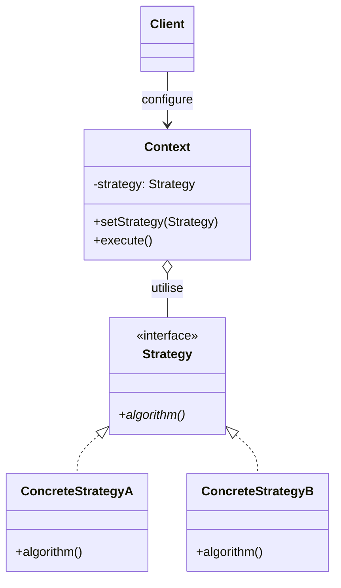
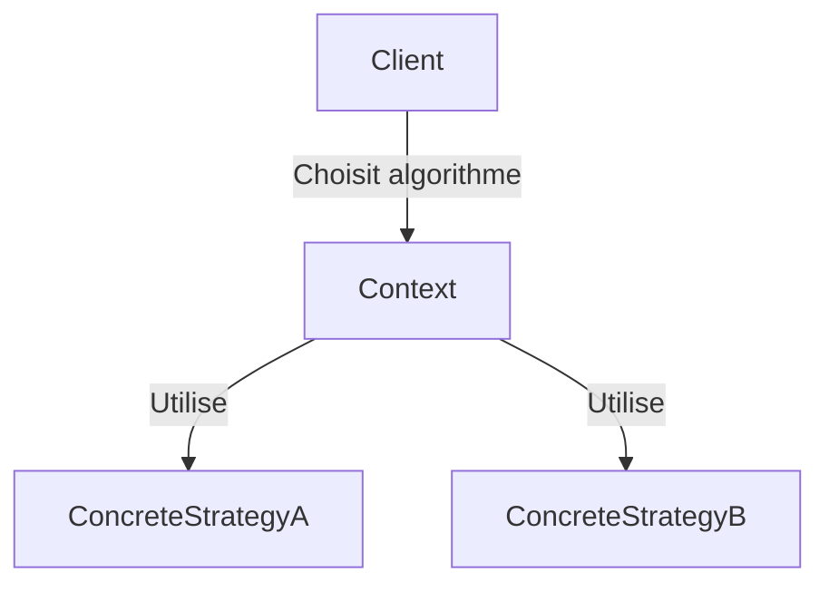
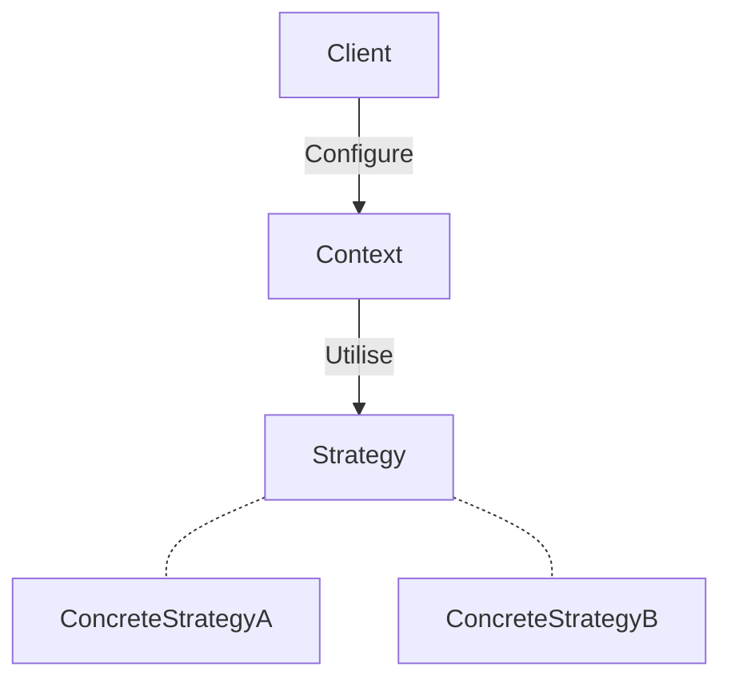

# Strategy

## Explication

**Strategy** désigne un **design pattern comportemental** (*behavioral design pattern*). La **stratégie** est une classe qui encapsule différents algorithmes, permettant de les rendre interchangeables. Elle permet de séparer la logique d'un algorithme de son utilisation, ce qui facilite la maintenance et l'évolution du code.

La **stratégie** est souvent utilisée pour implémenter des algorithmes de manière interchangeable, en fonction des besoins du client. Généralement, la **stratégie** est utilisée pour des algorithmes qui partagent une interface commune, ce qui permet au client de les utiliser sans se soucier de leur implémentation spécifique.

## Besoin

On utilise le **Strategy pattern** lorsqu'on a besoin de définir une famille d'algorithmes, de les encapsuler et de les rendre *interchangeables*. Cela permet au client de choisir l'algorithme à utiliser au moment de l'exécution, sans avoir à modifier le code du client.

Sans le **Strategy pattern**, le client pourrait être obligé d'utiliser des structures conditionnelles (comme des `if` ou des `switch`) pour choisir l'algorithme à utiliser, ce qui rendrait le code plus difficile à maintenir et à faire évoluer.

Ici, le choix réalisé par le client implique que le client doit connaître les différentes stratégies disponibles et les utiliser directement, ce qui crée un **couplage fort** entre le client et les algorithmes.

## Implémentation

L'implémentation du **Strategy pattern** implique généralement de :
1. **Définir une interface de stratégie** : Créer une interface qui définit les méthodes que les différentes stratégies doivent implémenter.
2. **Créer des classes de stratégie concrètes** : Implémenter l'interface de stratégie pour chaque algorithme spécifique.
3. **Créer une classe de contexte** : Cette classe utilise une référence à une instance de la stratégie pour exécuter l'algorithme. Elle peut également fournir une méthode pour changer la stratégie à utiliser.

## Limitations

> ⚠️ L'utilisation du **Strategy pattern** peut introduire une complexité supplémentaire, surtout si les algorithmes sont simples et ne nécessitent pas de fonctionnalités avancées. Il y a un risque d'**over-engineering**. Il ne faut pas l'implémenter à moins d'avoir plusieurs algorithmes à encapsuler et à rendre interchangeables.

> ⚠️ Le client doit avoir connaissance des différentes stratégies disponibles pour pouvoir les utiliser, ce qui peut créer un **couplage fort** entre le client et les algorithmes.

> ⚠️ Dans les langages de programmation plus modernes, il existe des alternatives au **Strategy pattern**. Dans le cas du C#, il est possible d'utiliser des **delegates** ou des **lambdas** pour encapsuler des algorithmes de manière plus concise, sans avoir à créer des classes de stratégie concrètes.

## Démonstration

[Code de démonstration](./StrategyDemo.cs)

## Sources

https://refactoring.guru/design-patterns/strategy