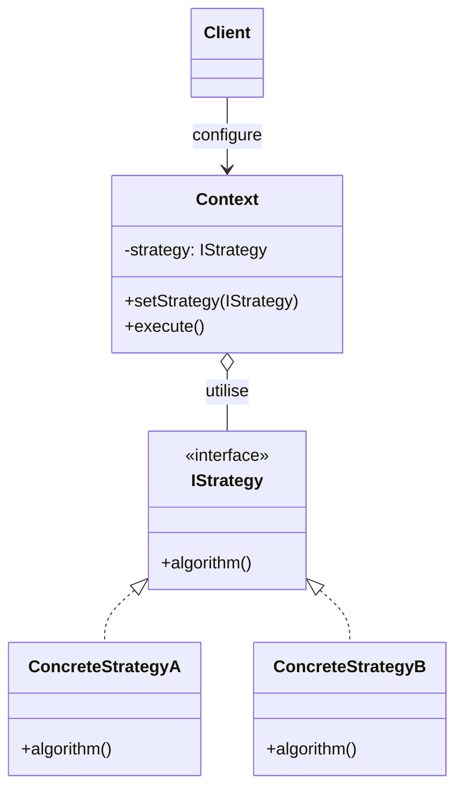
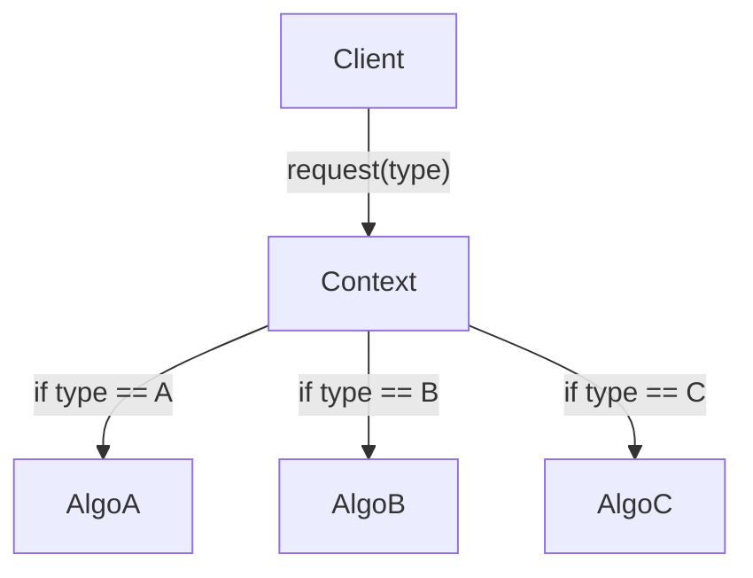
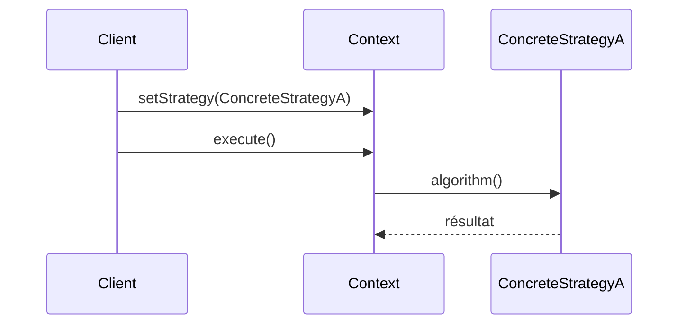

# Strategy

## Explication

**Strategy** est un **design pattern comportemental** (*behavioral design pattern*). La **stratégie** est une classe qui encapsule un algorithme derrière une interface commune, permettant de rendre différentes implémentations interchangeables. Le **Context** ne connaît pas l'implémentation choisie, il délègue l'exécution via l'interface, ce qui sépare la logique métier du choix de l'algorithme.

À ne pas confondre avec **[State](../State/README.md)**, qui partage la même structure mais où les transitions entre comportements sont initiées par les états eux-mêmes, et non par le client.

## Besoin

Sans le **Strategy pattern**, le Context doit contenir des structures conditionnelles pour choisir l'algorithme à exécuter. Plus le nombre d'algorithmes croît, plus ces conditions deviennent difficiles à maintenir :

Le **Strategy pattern** permet de sortir chaque algorithme dans sa propre classe, de les rendre interchangeables via une interface, et de laisser le client choisir la stratégie à injecter.

## Implémentation

1. **Définir une interface de stratégie** : déclarer la méthode commune que toutes les stratégies doivent implémenter.
2. **Créer des classes de stratégie concrètes** : implémenter l'interface pour chaque algorithme spécifique.
3. **Créer la classe Context** : elle détient une référence à l'interface et délègue l'exécution à la stratégie courante.

## Limitations

> ⚠️ **Overengineering** (*sur-ingénierie*) : si les algorithmes sont simples ou peu nombreux, le pattern introduit une complexité inutile. Des `if/else` restent parfois préférables.

> ⚠️ **Couplage client–stratégies** : le client doit connaître les stratégies disponibles pour en injecter une, ce qui crée une dépendance explicite.

> ⚠️ **Alternatives modernes** : en C#, des **delegates** ou des **lambdas** peuvent remplacer des classes de stratégie concrètes lorsque l'algorithme est simple, sans nécessiter de hiérarchie de classes.

## Démonstration

[Code de démonstration](./StrategyDemo.cs)

## Sources

https://refactoring.guru/design-patterns/strategy
[State/README.md](../State/README.md)